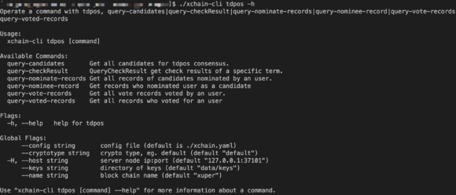

多节点网络搭建
==============

在阅读本节前，请先阅读“单节点网络”。当中介绍了创建单节点网络的创建，在该基础上，搭建一个SINGLE共识的多节点网络，其他节点只要新增p2p网络bootNodes配置即可。如果你想搭建一个TDPoS共识的链，仅需要修改创世块参数中“genesis_consensus”配置参数即可。下面将详细介绍相关操作步骤。

p2p网络配置
-----------

1. 假设搭建3个节点的网络，在单节点的基础上再新增两个节点node2和node3；

2. 创建node2和node3的部署路径，并按照5.2.1.2 建立每个节点自己的部署目录；

3. 查询node节点的netUrl，会得到节点netUrl

.. code-block:: console
    :linenos:

    ./xchain-cli netUrl get -H 127.0.0.1:37101

4. 在node2和node3的p2pv2配置中的bootNodes增加node的netUrl，如下所示：

.. code-block:: console
    :linenos:

    p2pV2:
    // port是节点p2p网络监听的端口，如果在一台机器上部署注意端口配置不要冲突，node配置的是47101，node2和node3可以分别设置为47102和47103
    port: 47102
    // 节点加入网络所连接的种子节点的链接信息，
    bootNodes:
    - "/ip4/127.0.0.1/tcp/47101/p2p/QmVxeNubpg1ZQjQT8W5yZC9fD7ZB1ViArwvyGUB53sqf8e"

5. 设置node2和node3节点RPC服务暴露的端口

.. code-block:: console
    :linenos:

    // port是节点启动时RPC服务监听的端口，如果在一台机器上部署注意端口配置不要冲突，node配置的是 :37101，node2和node3可以分别设置为 :37102和 :37103
    tcpServer:
    port: :37102

6. 启动node2和node3，check服务是否正常：

.. code-block:: console
    :linenos:

    ./xchain systemstatus -H 127.0.0.1:37102
    ./xchain systemstatus -H 127.0.0.1:37103

若节点高度一致，则网络启动成功。

搭建TDPoS共识网络
-----------------

TODO是搭建一个SINGLE共识的多节点网络。网络中的矿工节点是node。

XuperUnion系统支持可插拔共识，通过修改创世块的参数，可以创建一个TDPoS链。

下面创世块配置和单节点创世块配置的区别在于创世共识参数genesis_consensus的config配置，各个配置参数详解配置说明如下所示：

.. code-block:: console
    :linenos:

    {
        "version" : "1"
        , "predistribution":[
            {
                "address" : "mahtKhdV5SZP4FveEBzX7j6FgUGfBS9om"
                , "quota" : "100000000000000000000"
            }
        ]
        , "maxblocksize" : "128"
        , "award" : "1000000"
        , "decimals" : "8"
        , "award_decay": {
            "height_gap": 31536000,
            "ratio": 1
        }, "genesis_consensus":{
            "name": "tdpos",
            "config": {
                    "timestamp": "1548123921000000000", // tdpos共识初始时间，声明tdpos共识的起始时间戳，建议设置为一个刚过去不旧的时间戳
                    "proposer_num":"3",// 每一轮选举出的矿工数，如果某一轮的投票不足以选出足够的矿工数则默认复用前一轮的矿工
                    "period":"3000",// 每个矿工连续出块的出块间隔
                    "alternate_interval":"6000",// 每一轮内切换矿工时的时间间隔，需要为period的整数倍
                    "term_interval":"9000", // 切换轮时的出块间隔，即下一轮第一个矿工出第一个块距离上一轮矿工出最后一个块的时间间隔，需要为period的整数配
                    "block_num":"200",// 每一轮内每个矿工轮值任期内连续出块的个数
                    "vote_unit_price":"1",// 为被提名的候选人投票时，每一票单价，即一票等于多少Xuper
            // 指定第一轮初始矿工，矿工个数需要符合proposer_num指定的个数，所指定的初始矿工需要在网络中存在，不然系统轮到该节点出块时会没有节点出块
                    "init_proposer": {
                            "1":["RU7Qv3CrecW5waKc1ZWYnEuTdJNjHc43u","XpQXiBNo1eHRQpD9UbzBisTPXojpyzkxn","SDCBba3GVYU7s2VYQVrhMGLet6bobNzbM"]
                            }
                    }
            }
    }

修改完创世块参数后，删除./data/blockchain下的内容，3个节点全部重新创建链：

.. code-block:: console
    :linenos:

    ./xchain createChain

先启动node，再启动node2和node3，至此TDPoS共识的集群启动成功。

提名候选人
----------

.. code-block:: console
    :linenos:
    
    ./xchain-cli transfer --to=dpzuVdosQrF2kmzumhVeFQZa1aYcdgFpN --name=$chain --desc=./nominate.json --amount=11000002266 --frozen=-1 -H=$host

nominate.json

.. code-block:: json
    :linenos:

    {
        "module": "tdpos",
        "method": "nominate_candidate",
        "args": {
            "candidate": "提名address"
        }
    }

投票
----

.. code-block:: console
    :linenos:

    ./xchain-cli transfer --to=dpzuVdosQrF2kmzumhVeFQZa1aYcdgFpN --desc=./vote.json --amount=$ballots --frozen=-1 --name=$chain -H=$host

vote.json

.. code-block:: json
    :linenos:

    {
        "module": "tdpos",
        "method": "vote",
        "args" : {
            "candidates":["提名过的address"]
        }
    }

撤销提名 && 撤销投票
--------------------

.. code-block:: console
    :linenos:

    ./bin/xchain transfer --to Y4TmpfV4pvhYT5W17J7TqHSLo6cqq23x3 --desc=./revoke_demo.json --amount=1

revoke_demo.json (txid为提名或者投票时的txid,发起的交易的input需只有一个，且address与提名或者投票时需要相同)

.. code-block:: json
    :linenos:

    {
        "module":"proposal",
        "method": "Thaw",
        "args" : {
            "txid":"02cd75a721f2589a3ff6768b49650b46fa0b042f970df935b4d28a15aa19e49a"
        }
    }

TDPOS结果查询
-------------

.. code-block:: console
    :linenos:

    ./xchain-cli tdpos -h

提示如下所示：

    
    查询命令

1. 查询候选人信息

.. code-block:: console
    :linenos:

    ./xchain-cli tdpos query-candidates --name=$chain -H=$host

2. 查看某一轮的出块顺序

.. code-block:: console
    :linenos:

    ./xchain-cli tdpos query-checkResult -t=30 --name=$chain -H=$host

3. 查询提名信息：某地址发起提名的记录

.. code-block:: console
    :linenos:

    ./xchain-cli tdpos query-nominate-records --name=$chain -H=$host -a=dpzuVdosQrF2kmzumhVeFQZa1aYcdgFpN

4. 被提名查询：某个候选人被提名的记录

.. code-block:: console
    :linenos:

    ./xchain-cli tdpos query-nominee-record --name=$chain -H=$host -a=TyYCWDJ1pyV8fA3VyPenCdFdcPmHnwMhx

5. 某选民的有效投票记录

.. code-block:: console
    :linenos:

    ./xchain-cli tdpos query-vote-records --name=$chain -H=$host -a=dpzuVdosQrF2kmzumhVeFQZa1aYcdgFpN

6. 某候选人被投票记录

.. code-block:: console
    :linenos:

    ./xchain-cli tdpos query-voted-records --name=$chain -H=$host -a=TyYCWDJ1pyV8fA3VyPenCdFdcPmHnwMhx

常见问题
--------

1. 端口冲突：注意如果在一台机器上部署3个节点，各个节点的RPC监听端口以及p2p监听端口都需要设置地不相同，避免冲突；
#. 节点公私钥和节点netUrl冲突：注意网络中不同节点 ./data/keys下的文件和./data/netkeys下的内容都不一样，这两个文件夹是节点在网络中的唯一标识，每个节点需要独自生成，否则网络启动异常。
#. 启动时链接bootNodes节点失败：注意要先将bootNodes节点启动，再起动其他节点，否则会加入网络失败而启动失败。
#. The gas you cousume is: XXXX, You need add fee. 通过加--fee XXXX 参数附加资源