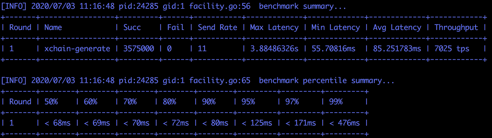
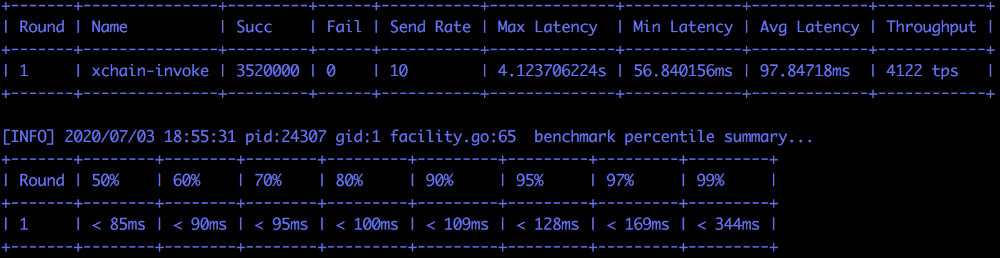
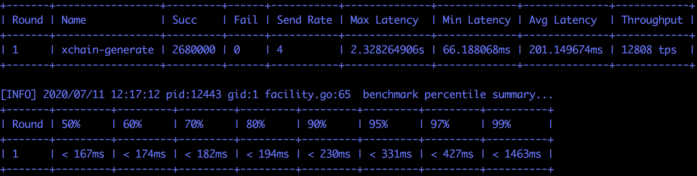
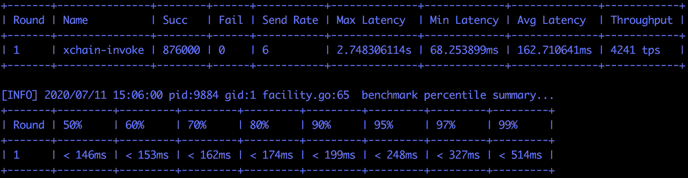

xchain性能测试使用文档
========================
这里介绍一下使用xbench工具进行xchain性能测试的方案。

测试拓扑
--------------
- xchain 由三个独立机器节点组成，xbench从另1台机器发压到1个node节点

.. image:: ../images/xchain-performance-1.PNG
    :align: center

- node节点机器硬件配置

  - cpu：Intel(R) Xeon(R) Gold 6148 CPU @ 2.40GHz 160核
  - 硬盘：nvme 7.1T*6
  - 内存：1510G
  - 系统：CentOS release 6.3 (Final)
  - 内核：3.10.0_3-0-0-22 x86_64 
  - 句柄数：10240
  - 网卡：Intel Corporation 82599EB 10-Gigabit SFI/SFP+ Network Connection

- 测试环境-网络参数

  + 平均时延：21.915 ms
  + 抖动：0.166 ms
  + 下行带宽：272 Mbits/sec
  + 上行带宽：1.24 Gbits/sec

环境搭建
--------------
xuperchain网络搭建
>>>>>>>>>>>>>>>>>>>

1. 下载xchain，并编译。

.. code-block:: bash

    git clone https://github.com/xuperchain/xuperchain.git 
    cd xuperchain 
    make 
    cp -r output node*
    # 重复上述步骤，在node1，node2，node3上编译xchain

2. 生成矿工地址和网络地址

.. code-block:: bash

    cd node* 
    rm -rf data/keys && rm -rf data/netkeys
    ./xchain-cli account newkeys
    ./xchain-cli netURL gen
    # 重复上述步骤在node1，node2，node3上生成矿工地址和网络地址

3. 修改各node port配置：conf/xchain.yaml

node1 如下:

::

     tcpServer:
         port: :17101
     p2p:
         port: 27101
   
node2 如下:

::
    
     tcpServer:
        port: :17102
     p2p:
        port: 27102
 
node3 如下:
   
::

    tcpServer:
        port: :17103
    p2p:
        port: 27103

4. 获取矿工地址和网络

.. code-block:: bash

    get neturl
    node1_neturl: ./xchain-cli netURL preview --port 27101
    node2_neturl: ./xchain-cli netURL preview --port 27102
    node3_neturl: ./xchain-cli netURL preview --port 27103
    get address
    node1_address: cat node1/data/keys/address
    node2_address: cat node2/data/keys/address
    node3_address: cat node3/data/keys/address

5. 修改node2、node3的bootnodes配置：conf/xchain.yaml
  | 因为 ``node1`` 为 ``bootnode`` ，地址为步骤3中 ``node1`` 的 ``neturl``

::

    p2p:
        bootNodes:
           - "/ip4/<node1_ip>/tcp/<node1_p2p_port>/p2p/<node1_hash>" 
   
6. 修改各node data/config/xuper.json配置
  | 地址为步骤3中 ``node1/node2`` 的 ``address`` 和 ``neturl``
    
.. code-block:: json

        "predistribution": [
        {
            "address": "node1_address",
            "quota": "100000000000000000000"
        },
        {
            "address": "node2_adress",
            "quota": "100000000000000000000"
        }
        ]  
        "genesis_consensus": {
        "name": "tdpos",
        "config": {
            "timestamp": "1559021720000000000",
            "proposer_num": "2",
            "period": "3000",
            "alternate_interval": "3000",
            "term_interval": "6000",
            "block_num": "20",
            "vote_unit_price": "1",
            "init_proposer": {
                "1": [
                     "nEnyPKZrgSJfhuoccWTUjJnK4o3wEhpiY","Z4aCZJ5yWN3KECdDGbQ6BAtCYkxYLvPwG"
                ]
             }
             "init_proposer_neturl": {
                "1": [
                    "/ip4/10.117.131.15/tcp/27101/p2p/Qme97v89162zZw55Nu4pAmuFg1ccabDQeXzZ5exeQzF56X",
                    "/ip4/10.117.135.37/tcp/27102/p2p/QmPaC7MVdNCQEiyF1ZgLYLM4rKSoVzRLVPdRSyzaaAnjHP"
                ]
            }
        }

7. 日志配置修改：conf/xchain.yaml
  | 关闭 ``console`` 输出，日志级别调为 ``warn``

::

    log:
       console: false
       level: warn

8. 启动底链网络

.. code-block:: bash

    ./xchain-cli createChain --host node*_ip:port
    nohup /home/xbench/apps/xuperchain/node*/xchain &
    # node1，node2,node3 重复上述步骤启动

9. 检查底链网络正常启动

.. code-block:: bash

    ./xchain-cli status -H=node1_ip:port|grep Height
    # node1\node2\node3高度一致，说明底链启动成功
    
10. 编译合约
  | 编译counter合约&实名合约：

.. code-block:: bash

    cd ./core/contractsdk/cpp
    ./build.sh
    cp ./core/contractsdk/cpp/build/counter.wasm /xbench/output/counter.wasm
    cp ./core/contractsdk/cpp/build/identity.wasm /xbench/output/unified_check.wasm

压测环境配置
>>>>>>>>>>>>>

1. 建合约账户/合约用户转账

.. code-block:: bash

    ./xchain-cli account new --account 1123581321345589 --fee 1000  -H  node1_ip:port
    ./xchain-cli transfer --to  XC1123581321345589@xuper --amount 548900  -H node1_ip:port  

2. 部署实名合约unified_check和性能测试合约counter 

.. code-block:: bash

    ./xchain-cli wasm deploy --account XC1123581321345589@xuper --cname unified_check -a '{"creator": "node1_address"}' unified_check.wasm   --fee 155338 -H node1_ip:port
    ./xchain-cli wasm deploy --account XC1123581321345589@xuper --cname proftestc -a '{"creator":"node1_address"}' counter.wasm  --fee 152806  -H node1_ip:port

3. 压测bank账户转账
  | xbench默认压测bank账户 ``dpzuVdosQrF2kmzumhVeFQZa1aYcdgFpN``

.. code-block:: bash

    ./xchain-cli transfer --to dpzuVdosQrF2kmzumhVeFQZa1aYcdgFpN  --amount 100 --keys data/keys/ -H node1_ip:port

4. 分割bank账户utxo

.. code-block:: bash

    ./xchain-cli utxo split -A dpzuVdosQrF2kmzumhVeFQZa1aYcdgFpN  -H node1_ip:port -N 100 -P xbench/output/data/ --keys xbench/output/data/keys/
    
同步模式
----------

generate转账性能
>>>>>>>>>>>>>>>>>>>>

| 描述：为事先创建N个账号并给他们一笔转账，然后这些账号开始给bank账号1块1块转账，主要测试转账性能
| 执行命令： ``bin/xbench -c conf/gen.json``
|    ``gen.json: workNum/number:650*5500``
    
.. code-block:: json

    {
        "type": "xchain",
        "workNum": 650,
        "mode": "local",
        "chain": "xuper",
        "crypto": "default",
        "host": "10.117.135.37:17102",
        "nodes": ["10.117.135.37:17102"],
        "rounds": [
            {
                "label": "generate",
                "number": [ 5500 ]
            }
        ]
    }

性能数据：7025 tps

查询账户性能
>>>>>>>>>>>>>
    
| 描述：压测合约查询性能，部署一个counter合约并increase一个key，然后N个并发查询这个key的值
| 执行命令： ``bin/xbench -c conf/query.json``
|   ``query.json：workNum/number:550*12000‘``
    
.. code-block:: json
        
    {
        "type": "xchain",
        "workNum": 550,
        "mode": "local",
        "chain": "xuper",
        "crypto": "default",
        "host": "10.117.135.37:17102",
        "nodes": ["10.117.135.37:17102"],
        "rounds": [
            :
                "label": "query",
                "number": [ 12000 ]
            }
        ]
    }

性能数据：13138 tps
    
.. image:: ../images/xchain-performance-3.PNG
    :align: center

合约调用性能
>>>>>>>>>>>>>

| 描述：压测合约执行性能，会事先部署一个counter合约，然后N个并发分别increase各自不同的key
| 执行命令： ``bin/xbench -c conf/invoke.json``
|   ``invoke.json：workNum/number:440*8000``
    
.. code-block:: json
        
    {
        "type": "xchain",
        "workNum": 440,
        "mode": "local",
        "chain": "xuper",
        "crypto": "default",
        "host": "10.117.135.37:17102",
        "nodes": ["10.117.135.37:17102"],
        "rounds": [
            {
                "label": "invoke",
                "number": [ 8000 ]
            }
        ]
    }
   

性能数据：4122 tps

异步阻塞模式
--------------

底链启动方式：

.. code-block:: bash

    nohup /home/xbench/apps/xuperchain/node*/xchain --asyncBlockMode true &
    node1，node2,node3重复上述步骤启动

generate转账性能
>>>>>>>>>>>>>>>>>

| 描述：为事先创建N个账号并给他们一笔转账，然后这些账号开始给bank账号1块1块转账，主要测试转账性能
| 执行命令： ``bin/xbench -c conf/gen.json``
|   ``gen.json: workNum/number:2680 *1000``

.. code-block:: json

        {
            "type": "xchain",
            "workNum": 2680,
            "mode": "local",
            "chain": "xuper",
            "crypto": "default",
            "host": "10.117.135.37:17102",
            "nodes": ["10.117.135.37:17102"],
            "rounds": [
                {
                    "label": "invoke",
                    "number": [ 1000 ]
                }
            ]
        }
    
性能数据：12808 tps
        

        
query查询账户性能
>>>>>>>>>>>>>>>>>>

| 描述：压测合约查询性能，部署一个counter合约并increase一个key，然后N个并发查询这个key的值
| 执行命令： ``bin/xbench -c conf/query.json``
|   ``query.json：workNum/number:1080*1200``

.. code-block:: json

        {
            "type": "xchain",
            "workNum": 1080,
            "mode": "local",
            "chain": "xuper",
            "crypto": "default",
            "host": "10.117.135.37:17102",
            "nodes": ["10.117.135.37:17102"],
            "rounds": [
                {
                    "label": "invoke",
                    "number": [ 1200 ]
                }
            ]
        }

性能数据：13115 tps
        
.. image:: ../images/xchain-performance-6.PNG
    :align: center
    
invoke合约调用性能
>>>>>>>>>>>>>>>>>>>
| 描述：压测合约执行性能，会事先部署一个counter合约，然后N个并发分别increase各自不同的key
| 执行命令： ``bin/xbench -c conf/invoke.json``
|    ``invoke.json：workNum/number:440*8000``
    
.. code-block:: json

        {
            "type": "xchain",
            "workNum": 730,
            "mode": "local",
            "chain": "xuper",
            "crypto": "default",
            "host": "10.117.135.37:17102",
            "nodes": ["10.117.135.37:17102"],
            "rounds": [
                {
                    "label": "invoke",
                    "number": [ 1200 ]
                }
            ]
        }

性能数据：4241 tps
        

