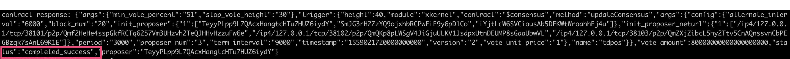

链上治理
===========

治理Token
-----------

 治理Token（治理代币）是XuperCore框架中，除UTXO原生代币之外的另一种代币形式，该代币仅用于特定的需要通过投票扭转状态的系统合约。和UTXO一样，治理Token总量和初始分配形式通过创世块配置指定，也同样支持转账、锁定与解锁以及查询。使用治理Token之后，能够将系统治理和原生代币分离开，从未减轻系统态和用户态耦合高带来的使用上的问题。

 目前治理Token被使用在“提案-投票”、共识升级以及作为Tdpos共识代币使用。建议用户在自定义开发时，对这些模块的相关智能合约进行慎重修改，否则可能导致系统层的安全隐患。

 治理Token的使用方法非常简单。

初始化
>>>>>>>>>>>>

	链运行起来时候，任意用户可以在任意时间内调用以下命令，来实现治理代币的初始分配，该分配仅会被调用一次。

.. code-block:: shell
    :linenos:

    // 注意，${FEE}具体值按照系统提示填写。
    ./bin/xchain-cli governToken init --fee ${FEE}
..

	上述指令将会将治理Token分配给创世块配置中指定的用户，具体在xuper.json的predistribution中获取，predistribution是个数组，如果存在多个初始账户，总量会进行累加。

	创世块配置示例如下：

.. code-block:: json
    :linenos:

    {
        "version" : "1", 
        "predistribution":[{
            "address" : "TeyyPLpp9L7QAcxHangtcHTu7HUZ6iydY",
            "quota" : "1000000000000000"
        }],
        "maxblocksize" : "128",
        "award" : "1000000",
        "decimals" : "8",
        "award_decay": {
            "height_gap": 31536000,
            "ratio": 0.5
        },
        "new_account_resource_amount": 1000,
        "genesis_consensus":{
            "name": "pow",
            "config": {
                "defaultTarget": "545259519",
                "adjustHeightGap": "5",
                "expectedPeriod": "15",
                "maxTarget": "486604799"
            }
        }
    }

查询
>>>>>>>>>>>

 可根据下述命令查询用户治理Token余额信息，包括不同场景下锁定的代币数量等。目前支持多种代币锁定状态，lock_type字段表示了当前治理Token在哪种合约中被锁定，被锁定的代币在同一lock_type下的系统合约中，不可被二次抵押。

.. code-block:: shell
    :linenos:

    // 注意，${ADDRESS}指代了具体的合约账号地址
    ./bin/xchain-cli governToken query -a ${ADDRESS}

转账
>>>>>>>>>>>

 转账操作。

.. code-block:: shell
    :linenos:

    // 注意，下述投票时必须确保acl或者address账户拥有代币，即先向账户发起transfer，否则会报失败错误
    ./bin/xchain-cli governToken transfer --to ${ADDRESS} --amount ${AMOUNT} --fee ${FEE}
..

 转账操作会根据lock_type指定的不同场景下的状态来判断余额，具体逻辑为锁定余额的最小值，比如下面场景：

.. code-block:: shell
    :linenos:

    ./bin/xchain-cli governToken query -a TeyyPLpp9L7QAcxHangtcHTu7HUZ6iydY 
    // contract response: {"total_balance":100000000000000000000,"locked_balances":{"ordinary":99999999999999961000,"tdpos":0}}
..

 账户总的余额为100000000000000000000，oridinary场景相被锁定了99999999999999961000，tdpos场景下被锁定为0，此时可以被转账的数量为：

.. code-block:: shell
    :linenos:

    39000 = min(100000000000000000000 - 99999999999999961000, 100000000000000000000 - 0)
..
 
 可以继续参与oridinary场景投票的数量为：

.. code-block:: shell
    :linenos:

    39000
..

 可以参与tdpos场景投票的数量为：

.. code-block:: shell
    :linenos:

    100000000000000000000
..

提案投票
----------

 XuperCore 目前提供的智能合约使用了“预执行-执行”流程，当交易被提交到节点后，状态机通过验证后会被更改状态，因此，依托于智能合约的系统合约也同样遵循这样的特点。然而，在区块链系统中，有某些特定场景要求交易以区块粒度被执行，当且仅当该区块被认定为主链上区块且通过验证后，特定的交易才会被触发，基于此，XuperCore提供了一种延迟合约执行机制（被称为Timer）。

 提案投票机制依托于Timer实现，其主要功能为从治理委员会中收集针对某特定提案的选票，当选票达到阈值后，在特定区块高度下全网节点触发执行。

 当某提案被生成后，将会通知全网的节点，全网有治理Token的节点将有权力对其进行投票，提案的状态有如下几种：

.. code-block:: shell
    :linenos:

    ProposalStatusVoting              = "voting"                提案投票中
    ProposalStatusCancelled           = "cancelled"             提案被提案发起者给撤销了；已经被vote的proposal不能被撤销
    ProposalStatusRejected            = "rejected"              投票未被通过
    ProposalStatusPassed              = "passed"                投票已经通过，等待被执行
    ProposalStatusCompletedAndFailure = "completed_failure"     投票已经通过，但是提案内容，执行失败
    ProposalStatusCompletedAndSuccess = "completed_success"     投票已经通过，而且提案内容，执行成功
..

共识升级
-----------
 XuperCore的热插拔共识提供了切换共识的功能，在系统中被称为“共识升级”，共识升级支持共识A切换到共识B。

 注意，在整个共识生命周期内，每种共识仅支持单一配置，不支持同一种类共识的参数配置修改。如系统初始共识为Tdpos（本例代称A），可升级为Xpos（本例代称B），可继续升级为Xpoa（本例代称C），但不支持由A升级成同为Tdpos但配置不同的共识（本例代称D），另外，共识回滚也是允许的，即升级到共识B后，可继续升级到共识A（配置需相同）。

 XuperCore的共识升级基于“提案-投票”机制开发。

 完整的共识升级流程将在下面详细介绍。

治理Token生成
>>>>>>>>>>>>>>>>>>

 共识升级的先决条件是必须先生成相关治理Token，用户可参照5.1命令向对应的账号转账治理Token，以确保下面的流程可以继续。

共识升级提案
>>>>>>>>>>>>>>>>>>

 共识升级的第一步是创建提案，按照下述命令执行成功后，会生成一个提案ID，用户需记住该ID确保后面的流程可以继续。

.. code-block:: shell
    :linenos:

    // 注意，${FEE}根据系统提示填写，${JSON}的具体示例将在下面介绍。
    ./bin/xchain-cli proposal propose --proposal ${JSON} --fee ${FEE}
..

 提案时需要提交一个json文件作为proposal参数的输入，该文件将指定共识提案的投票截止时间，通过的阈值标准，以及执行时升级的目的共识配置。

.. code-block:: shell
    :linenos:

    // proposal.json 是一个共识升级文件示例
    // 其规定了投票总票必须大于原生代币总数的51%（代币总数=创世块配置总数）
    // 若投票总数不及要求，提案将失败不被执行
    // 所有的投票动作均需早于200高度进行，否则投票无效。

    {
        "args" : {
            "min_vote_percent": "51", // 共识升级通过的要求代币量，以代币总数的百分比表示
            "stop_vote_height": "200" //共识投票截止时间，以主链高度表示
        },
        "trigger": {
            "height": 250, // 共识升级触发时间，注意，该高度必须大于上述“stop_vote_height”字段，共识将在height之后生效
            "module": "xkernel",
            "contract": "$consensus",
            "method": "updateConsensus",
            // args中包含的字段与genesis创世块配置中的共识args需相同，表示要升级的目的共识配置
            "args" : {
                "name": "tdpos",
                "config": {
                    "version":"2",
                    "proposer_num":"3",
                    "period":"3000",
                    "alternate_interval":"6000",
                    "term_interval":"9000",
                    "timestamp": "1559021720000000000",
                    "block_num":"20",
                    "vote_unit_price":"1",
                    "init_proposer": {
                        "1":["TeyyPLpp9L7QAcxHangtcHTu7HUZ6iydY", "SmJG3rH2ZzYQ9ojxhbRCPwFiE9y6pD1Co", "iYjtLcW6SVCiousAb5DFKWtWroahhEj4u"]
                    }
                }
            }
        }
    }

共识升级投票
>>>>>>>>>>>>>>>>>>

 有治理Token的用户可以通过下述命令对提案进行投票。

.. code-block:: shell
    :linenos:

    // ${PID}表示提案的代号ID，该ID在生成提案时回返回。
    ./bin/xchain-cli proposal vote --pid ${PID} --amount ${AMOUNT} --fee ${FEE}
..

 在整个网络高度 > trigger_height 时，共识升级会生效，可通过共识查询命令行consesus status检验。

共识提案查询
>>>>>>>>>>>>>>>>>>>

 者通过proposal query可查询提案当前状态，注意status字段，若为voting，目的提案仍处于可投票阶段，若为passed，目的提案处于stop_vote_height到trigger_height之间，若为completes_success，目的提案已生效。可通过下述命令查询。

.. code-block:: shell
    :linenos:

    ./bin/xchain-cli proposal query --pid ${PID}
..

    一个成功升级的示例图
