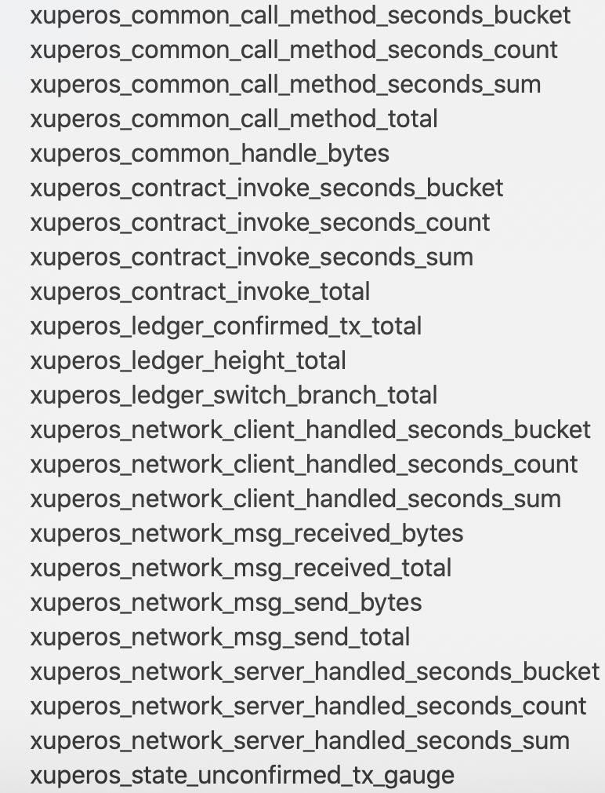

监控说明
==============

 XuperChain 系统集成了Prometheus开源监控框架，用户可以通过Prometheus+Grafana构建自己应用的监控系统，并且用户还可以根据自己的需求定义自己的监控采集项。下面会介绍目前 XuperChain 默认采集的监控项，并指导用户如何搭建自己本地的 XuperChain 开源监控系统。

XuperChain 监控项
----------------------

目前支持的监控项如下图：

每个大项说明如下：
    - xuperos_common_call_method_seconds：调用方法监控，可以查看到每个函数的数据； 
    - xuperos_contract_invoke：合约调用相关监控项；
    - xuperos_ledger：账本相关数据监控项；
    - xuperos_network：网络相关监控项。

XuperChain 监控系统搭建
-------------------------

搭建网络
>>>>>>>>>

搭建网络，节点 env.yaml 配置中打开 metricSwitch ，如下所示：

.. code-block:: bash
    
    # Metric switch
    metricSwitch: false

同时在 server.yaml 中可以设置端口，如果是多个节点，每个节点都需要设置：

.. code-block:: bash

    metricPort: 37201

使用Prometheus查看监控
>>>>>>>>>>>>>>>>>>>>>>>>

在 `xbench <https://github.com/xuperchain/xbench>`_ 项目中，有可以直接使用的 `配置文件 <https://github.com/xuperchain/xbench/blob/master/conf/metric/prometheus.yml>`_ ，同时也可以参考下面的示例自己搭建。

1. prometheus 安装教程:

   a. https://prometheus.io/docs/introduction/first_steps/
#. 配置prometheus 设置endpoint服务:

   a. 修改 prometheus.yml 文件，添加如下配置，每个 target 对应 xchain 节点的 server.yaml 中的 metricPort 端口:

   .. code-block:: bash

    scrape_configs:
    - job_name: 'xchain'
      scrape_interval: 3s
      static_configs:
        - targets:
           - '127.0.0.1:37201'
           - '127.0.0.1:37202'
           - '127.0.0.1:37203'

#. 启动prometheus:

    .. code-block:: bash

        nohup ./prometheus --config.file=prometheus.yml &

#. 查看对应监控项，以下是三个节点监控示例：
   
   a. http://localhost:9090/graph
   
   b. xuperos_common_call_method_seconds_bucket，在页面下面可以看到每个节点以及方法的详细信息：

   .. image:: ../images/monitor_1_call_method_seconds_bucket.jpg
       :align: center
       :scale: 50

   c. ledger_confirmedTx_total：

   .. image:: ../images/monitor_2_ledger_confirmedTx_total.jpg
       :align: center
       :scale: 50

   d. network_msg_received_total

   .. image:: ../images/monitor_3_network_msg_received_total.jpg
       :align: center
       :scale: 50

使用Grafana查看监控
>>>>>>>>>>>>>>>>>>>>

因为Prometheus的界面看起来非常简单，我们还可以通过Grafana这个非常强大也是最常用的监控展示框架。

使用文档参看： https://grafana.com/grafana/download

在 `xbench <https://github.com/xuperchain/xbench>`_ 项目中，同样提供了可以直接使用的 grafana 模板，要和上面的 prometheus 配置文件一起使用。

使用接口查看监控
>>>>>>>>>>>>>>>>>

Prometheus提供了一种功能查询语言PromQL（Prometheus查询语言），它允许用户实时选择和聚合时间序列数据。同时为了方便外部系统调用，还提供了HTTP API能力。

详情请参考： https://prometheus.io/docs/prometheus/latest/querying/api/

1. grafana 安装教程：https://grafana.com/grafana/download?pg=get&plcmt=selfmanaged-box1-cta1 下载安装包后，解压后可直接启动

    .. code-block:: bash
        
        nohup ./bin/grafana-server &

    之后访问 http://localhost:3000/ 即可。 

2. 导入数据源，在 grafana 页面导入数据源并选择 Prometheus：

    .. image:: ../images/monitor_4_grafana_data_source.jpg
        :align: center

3. 导入 grafana 模板，在页面上创建新的 dashboard，然后导入 xbench 下的 `模板 <https://github.com/xuperchain/xbench/blob/master/conf/metric/grafana-xchain.json>`_
    
    .. image:: ../images/monitor_5_grafana_settings_json.jpg
        :align: center

4. 成功后便可以看到如下内容：
    
    .. image:: ../images/monitor_6_grafana_dashboard.jpg
        :align: center