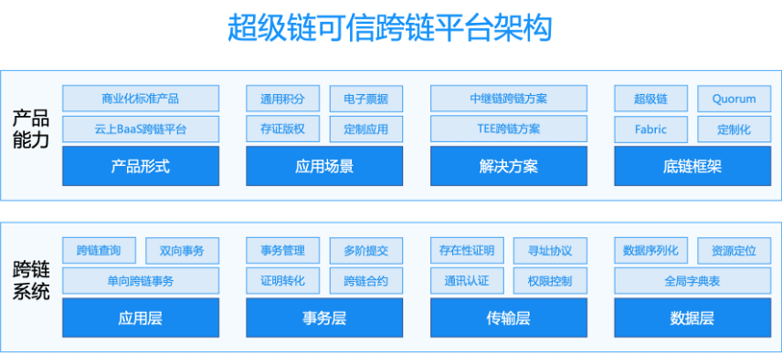
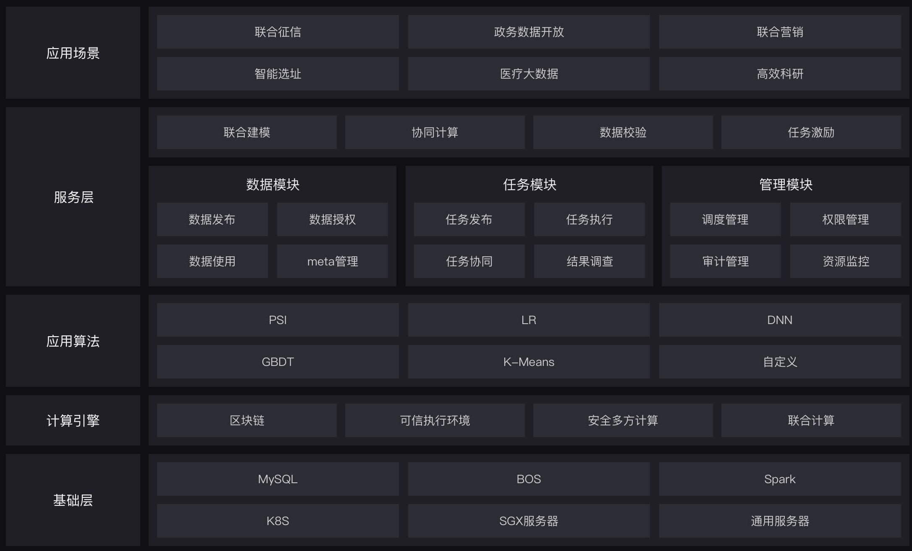
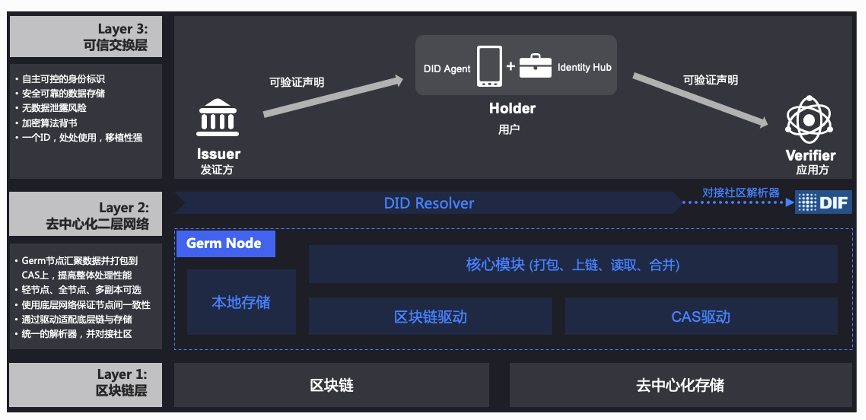

高级功能
================

可信跨链
------------------
超级链可信跨链（XuperCross），是百度自研通用的、标准化的区块链互操作领先解决方案。百度超级链是跨链协议和标准制定的领导者，牵头制定IEEE C/BDL、ITU等跨链国际标准，和《国家区块链安全框架》、《信息安全技术 区块链信息服务安全规范》、《区块链互操作技术要求》等国家标准，推出可信跨链则致力于构建各个行业领域协同发展的区块链生态。

可信跨链的优势包括多网络跨链，支持同构或异构链事物数据可信互联互通，包括公链、私链、联盟链之间的多链交互。基于通用的XIP底层协议，提供跨链中继、中继链和可信中继三种方案，同时支持云上可信跨链平台、私有化等多种接入形式。

超级链可信跨链支持同、异构链的跨链互操作系统，构建通用跨链服务，实现基于区块链底层技术平台技术体系架构下，应用链间的同构跨链和现有区块链系统的异构跨链，实现区块链之间数据共享与业务协同。其核心功能如下：

1. **完全自主研发可控**：跨链技术完全国产自主研发且可控。
2. **标准化跨链协议**：底层协议标准化，各个区块链体系之间不存在隔膜，可快速互联互通。
3. **链外服务稳定性**：链外中继服务能在跨链交易中正确应对断电、重启、网络波动等异常场景；中继能够防止拜占庭行为，防止数据篡改；中继是无状态的；中继与区块链间支持基于TLS的安全通信。
4. **异构通用性**：链系统不对区块链框架的智能合约虚拟机、共识协议和数据结构有要求；可以对非默克尔树结构的区块链进行适配。
5. **平行链热插拔**：链系统能够实现平行链的热插拔，即支持在不影响跨链系统运营的情况下对平行链进行接入、退出和更新。
6. **区块链资源定位**：具备跨链寻址能力，能够通过统一的区块链资源地位器对不同区块链进行寻址调用。
7. **管理和审计**：平行链具备业务合约管理、中继链管理和权限控制能力，防止跨链权限滥用；中继链具备平行链的管理、审核和更新等机制；跨链行为可以在中继链、平行链上进行审计。
8. **跨链事务**：链事务满足ACID特性；在异常场景中能够有效地将跨链交易回滚；并能够追溯事务状态。
   
产品优势包括：

1. **多网络跨链**：可信跨链平台提供同构或异构的链间互操作，包括公链、私链、联盟链之间的多链交互。
2. **跨链方案丰富**：多方案并存，支持中继、可信中继、中继链三种跨链方案，同时支持云上可信跨链平台、私有化等多种接入形式。
3. **XIP底层协议支撑**：XIP协议保证跨链数据交互的真实性和跨链事务的ACID特性，实现不同服务模型、不同网络的跨链互通。
4. **高易用性**：跨链请求类型覆盖多场景，初始化步骤及跨链请求均为自动化，接入成本低，初始化简单。

可信跨链主页： https://xuper.baidu.com/n/case/crosschain

云上可信跨链平台： https://cloud.baidu.com/solution/block-chain/platform.html?track=navigation20200904

隐私计算
------------------
隐私计算是百度超级链提供的结合区块链技术的数据安全计算服务，实现数据的生产、存储、计算、应用的全流程安全可审计，保证多方协同中“数据可用不可见”和“过程可信可追溯”，帮助客户打破数据孤岛，充分发挥数据价值。

超级链隐私计算平台是运行在区块链网络之上的分布式隐私数据计算平台，节点依托于区块链智能合约完成信息共享与任务协作，并在节点之间构建可信安全通道，进行隐私数据的流转。平台具有全程链上存证、数据安全流通、高性能通用计算的特点。

平台基于英特尔SGX技术构建的可验证的可信执行环境，保证数据在链下计算时的安全性与隐私性，配合区块链本身提供的去中心化、防篡改的特性，实现数据计算全链路安全可靠，全面满足数据安全流通与计算技术的需求。

平台支持多种不同的部署方案，可以根据业务场景灵活地选择合作模式。

1. **全节点**：包括区块链节点与可信计算节点，可以本地完成算法开发、数据管理、任务计算等全部功能，需要本地具有支持SGX的硬件服务器
2. **轻节点**：本地仅部署部分组件，完成算法开发或任务发布等部分功能
3. **仅客户端**：不部署任何组件，依靠某一个全节点，使用客户端完成全部操作
4. **审计**：不部署可信计算节点，仅依靠区块链实现审计

隐私计算主页： https://xuper.baidu.com/n/case/xuperdata

云上隐私计算平台： https://xuper.baidu.com/n/console#/privatecomputing/overview 

分布式身份
------------------

百度DID是基于区块链技术的分布式数字身份（Decentralized ID, DID）是可验证的、自我主权的、新型数字身份。建设分布式数字身份服务，支持用户通过分布式数字身份对隐私数据进行自主控制，实现信息数据安全存储、授权共享可控可追溯、选择性披露隐私信息等场景，并能够兼容多底链、支持跨平台、跨身份协议的互操作。

相对于传统的基于PKI（公钥基础设施）的身份体系，基于区块链建立的分布式数字身份系统具有保证数据真实可信、保护用户隐私安全、可移植性强等特征，其优势在于：

1. **去中心化**：基于区块链，避免了身份数据被单一的中心化权威机构所控制。
2. **身份自主可控**：基于DPKI （分布式公钥基础设施），每个用户的身份不是由可信第三方控制，而是由其所有者控制，个人能自主管理自己的身份。
3. **可信的数据交换**：身份相关数据锚定在区块链上，认证的过程不需要依赖于提供身份的应用方。
4. **完全自主研发可控**：分布式数字身份技术完全国产自主研发且可控。
5. **技术设施标准化**：DID 技术设施（DID、VC 等）建设标准化，通用化，符合 W3C国际规范，对接知名 DID 社区（例如：DIF），方便快速接入。
6. **高性能 DID 操作**：基于区块链与分布式存储，使用 Sidetree协议建设高性能二层网络，能够解决底层区块链 TPS性能低、存储资源昂贵、共识差异等缺点。
7. **异构通用性**：分布式身份技术能够适配不同的底链架构，不对具体区块链的共识协议、数据结构有要求，并且能够应对底层区块链的分叉。
8. **数据安全性**：分布式身份服务支持数据安全存储、检索、分享，隐私数据不泄露，选择性披露等特性，并要求对数据使用记录可控可追溯。
9. **身份可控性**：分布式数字身份技术能保证用户自主控住其身份并对自己身份及相关信息进行证明，同时又可对数字身份进行一定程度上的托管和维护，具备完善的密钥恢复机制，方便用户使用。对业务场景中一些危险、违规的行为操作和账号也可进行控制，保证业务场景安全合规。
10. **开箱即用**：分布式数字身份服务具备多语言 SDK、命令行工具等，开箱即用，方便业务方快速接入。
11. **安全拓展**：分布式身份技术能够支持跨链、跨平台的交互，具备跟物联网IoT技术结合的能力，支持国产化硬件设备接入，便于扩展到不同的应用场景下。

分布式身份主页： https://did.baidu.com/