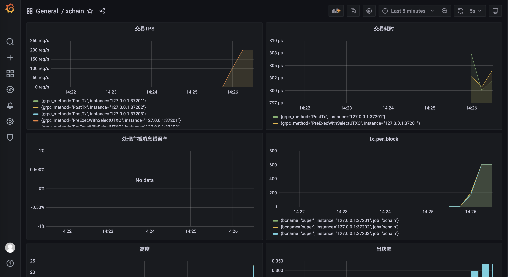

压测工具
========================
`xbench <https://github.com/xuperchain/xbench>`_ 是 XuperChain 的压测工具，支持和 Prometheus + Grafana 监控节点。
同时支持转账、存证、合约等相关压测场景，可以通过 grafana 实时看到节点状态。

本章主要介绍创建 XuperChain 三个节点，使用 xbench 进行压测，Prometheus + Grafana 监控系统的流程。如果你有其他场景的测试，可以参考此章节。

环境搭建
--------------
xuperchain网络搭建
>>>>>>>>>>>>>>>>>>>
这里使用 xuperchain 自带的 testnet 示例网络来进行测试，三个节点，其中共识可以在搭建网络时进行选择。

同时本示例中使用 Prometheus + Grafana 监控节点，可以参考 `系统监控 <./monitor_usage.html>`_ 一节。

1. 下载xchain，并编译。

.. code-block:: bash

    git clone https://github.com/xuperchain/xuperchain.git 
    cd xuperchain 
    make 
    make testnet

2. 在执行 make testnet 后，会创建 testnet 目录，同时下面还有 node1、node2、node3 目录，
   在 node1/data/genesis 目录下有多个创世文件，包括 xpos、xpoa、pow 共识等，本次示例使用 xpos 共识：

.. code-block:: bash

    cd node* 
    cp data/genesis/xpos.json data/genesis/xuper.json
    # 重复上述步骤在node1，node2，node3目录下执行。

3. 修改配置文件，启用监控，三个节点的 /conf/env.yaml 配置中打开 metricSwitch ，如下所示：

.. code-block:: bash
    
    # Metric switch
    metricSwitch: false

4. 启动网络：
   
.. code-block:: bash

    cd node* 
    sh control.sh start
    # 重复上述步骤在node1，node2，node3目录下执行。

xbench 使用
>>>>>>>>>>>>>>>>>>>

1. 下载 xbench，并编译。

.. code-block:: bash

    git clone https://github.com/xuperchain/xbench.git 
    cd xbench
    make

2. 准备测试资源。xbench 在编译成功后，output 目录下会有 data/bank 目录，此目录下的 address 文件中的地址为 xbench 测试时需要的初始地址。
   
在 xuperchain 的 testnet/node1 目录下执行以下命令转账给 xbench 账户：

.. code-block:: bash

    ./bin/xchain-cli transfer --to dw3RjnTe47G4u6a6hHWCfEhtaDkgdYWTE --amount 1000000000000
    #其中 dw3RjnTe47G4u6a6hHWCfEhtaDkgdYWTE 地址为 xbench 下 data/bank/address 地址。

3. xbench 配置文件。在使用 xbench 压测时，需要指定配置文件，配置文件中选择进行转账压测、存证压测还是合约压测。xbench 启动命令为：

.. code-block:: bash

    ./bin/xbench --config=./conf/transfer.yaml

上面的命令指定配置文件为 transfer.yaml，也就是进行转账压测。如果进行去他压测指定对应配置文件即可。

同时每个配置文件可以设置负载模式和并发模式，比如恒定的 RPS 测试、步进增长的 RPS、恒定并发请求、步进增长的并发请求等，
更多配置参考 `这里 <https://github.com/xuperchain/xbench/blob/master/conf/bench.yaml>`_。

通过 Grafana 查看系统状态
>>>>>>>>>>>>>>>>>>>>>>>>>>>>
如果你到现在已经完成了 xchain 网络的搭建、Prometheus + Grafana 的配置与启动、xbench 的配置，启动 xbench 后，便可以通过浏览器查看各种图表，
浏览器访问 http://127.0.0.1:3000 到 Grafana 页面，同时找到配置好的 dashboard。如果不能成功访问，
可以参考 `系统监控 <./monitor_usage.html>`_ 一节检查 Prometheus + Grafana 的配置与启动。成功的页面类似如下：

更多的 xbench 使用参考 `xbench <https://github.com/xuperchain/xbench>`_ 项目。