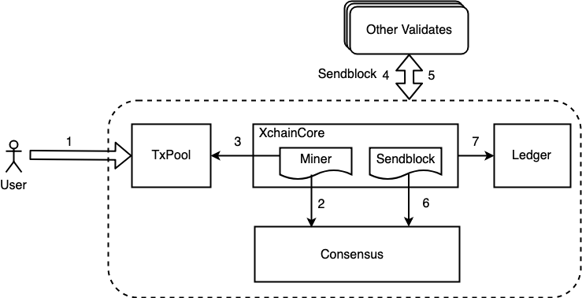

XuperChain 共识框架
==============

区块链共识机制概述
------------------

区块链系统多数采用去中心化的分布式设计，节点是分散在各处，系统需要设计一套完善的制度，以维护系统的执行顺序与公平性，统一区块链的版本，并奖励提供资源维护区块链的使用者，以及惩罚恶意的危害者。这样的制度，必须依赖某种方式来证明，是由谁取得了一个区块链的打包权(或称记帐权)，并且可以获取打包这一个区块的奖励;又或者是谁意图进行危害，就会获得一定的惩罚，这些都是区块链系统的共识机制需要解决的问题。

随着区块链应用落地场景越来越多，很多适应不同应用场景的共识算法先后被提出。但是在当前的技术背景下，功能过于全面的共识算法无法真正可用。在新一代区块链共识机制的设计过程中，根据实际应用场景，有的放矢的选择去中心化、节能、安全等设计原则，对一些原则支持强弱进行取舍，将一定程度上提升系统的整体运行效率。

我们 XuperChain 设计上是一个通用的区块链框架，用户可以方便地进行二次开发定制。 XuperChain 的共识模块设计上是一个能够复用底层共识安全的共识框架，用户基于这样的框架可以轻松地定义其自己的链，而不需要考虑底层的共识安全和网络安全。

XuperChain 共识框架概览
------------------

.. image:: ../images/consensus-1.png
    :align: center

上图是 XuperChain 共识模块的整体架构图，自底向上主要包括3层：

| 1. **共识公共组件层**：该层主要是不同共识可以共用的组件，包括共识公共节点Consensus、Interface、Chained-BFT、GPS原子钟等，它可以为链提供底层的共识安全性保障；
| 2. **共识类型层**：中间层为 XuperChain 以及支持或者即将支持的共识类型，主要包括TDPoS、Pow、授权共识等，基于底层的共识安全能力。在这一层，用户可以定义有自己特色的共识类型，如类似TDPoS这种选举机制的共识，也可以定义Stakeing等的相关逻辑；
| 3. **可插拔共识层**：最上层是可插拔共识的运行态，包括Step Consensus 和Pluggable Consensus两个实例，该层主要负责维护了链从创建到当前高度的共识的所有升级历史。 XuperChain 的共识升级主要依赖系统的提案和投票机制，详情请查看 `提案和投票机制文档 <proposal.html>`_

XuperChain 共识矩阵
----------------
目前 XuperChain 主要支持了四种共识，总结如下:

+----------------+----------------------+------------+
|  共识算法名称  |  是否基于chained-BFT |  确认效率  |
+================+======================+============+
| XPoA           | 是                   |  3个区块后 |
+----------------+----------------------+------------+
| XPoS           | 是                   |  3个区块后 |
+----------------+----------------------+------------+
| PoW            | 否                   |  经验值    |
+----------------+----------------------+------------+
| Single         | 否                   |  当即确认  |
+----------------+----------------------+------------+

XuperChain 共识主流程
----------------

 XuperChain 的是一个多链架构，其中单个链的主要逻辑在 ``core/xchaincore.go`` 文件中，其中与共识模块交互的函数主要有2个，分别是 ``Miner()`` 和 ``SendBlock()`` ：

1. Miner(): 这个函数的主要功能有2点，首先判断自己是否为当前的矿工，当判断自己是矿工时需要进行区块打包。
2. SendBlock(): 这个函数是节点收到区块时的核心处理逻辑，当节点收到一个区块时会调用共识模块的相关接口进行区块有效性的验证，当验证通过后会将区块写入到账本中。

 XuperChain 的共识整体流程如上图所示，主要包括7个步骤：

1. 用户提交交易到网络，交易执行完后会进入未确认状态，并记录在交易的未确认列表中TxPool中;
2. 节点的Miner流程通过访问Consensus模块判断自己是否为当前的矿工；
3. 当节点判断自己是矿工时需要从TxPool中拉取交易并进行区块的打包；
4. 当矿工完成打包后会将区块广播给其他的验证节点，同时会通过步骤7将区块写入到账本；
5. 如果某个时刻其他节点判断自己是矿工，同样地会按照上述1-5流程进行区块打包，打包完后会将区块广播给该节点；
6. 节点收到区块后，会调用consensus模块进行区块的有效性验证；
7. 矿工打包完后或者验证节点收到一个有效的区块后，将区块写入账本；

接口介绍
--------

整个共识框架主要有2套接口，分别是共识基础接口和共识安全接口，适用的场景不同。

场景一：用户希望定义自己的共识功能并独立负责共识安全；那么用户仅需要实现共识基础接口；
场景二：用户希望定义自己的共识功能，但是希望框架底层能帮助保证共识安全；那么用户需要实现共识基础接口和共识安全接口；

共识基础接口
^^^^^^^^^^^^

共识基础接口是共识模块的核心接口，是与core模块交互的主要部分。其中最核心的部分主要是 ``CompeteMaster`` 和 ``CheckMinerMatch`` 两个。 ``CompeteMaster`` 是一个节点判断自己是否为主的主要逻辑， ``CheckMinerMatch`` 是节点收到一个区块验证其区块有效性的主要逻辑。

.. code-block:: go
    :linenos:

    // consensus/base/consensusinterface.go
    type ConsensusInterface interface {
        Type() string
        Version() int64
        InitCurrent(block *pb.InternalBlock) error
        Configure(xlog log.Logger, cfg *config.NodeConfig, consCfg map[string]interface{},
            extParams map[string]interface{}) error
        CompeteMaster(height int64) (bool, bool)
        CheckMinerMatch(header *pb.Header, in *pb.InternalBlock) (bool, error)
        ProcessBeforeMiner(timestamp int64) (map[string]interface{}, bool)
        ProcessConfirmBlock(block *pb.InternalBlock) error
        GetCoreMiners() []*MinerInfo
        GetStatus() *ConsensusStatus
    }

共识安全接口
^^^^^^^^^^^^

共识安全接口是保证底层共识安全的核心接口，共识框架底层支持了 ``Hotstuff`` 算法的的高性能的共识安全模块 ``Chained-BFT`` 。暴露出了 ``PacemakerInterface`` 和 ``ExternalInterface`` 接口，其中 ``PacemakerInterface`` 是 ``Chained-BFT`` 的活性保证，此外为了扩展 ``Chained-BFT`` 安全模块能够应用于更多的仲裁类型， 底层 ``Chained-BFT`` 设计上不需要理解仲裁的具体内容，通过 ``ExternalInterface`` 会与外层的共识进行通信，接口的具体定义如下，更详细的内容可以参见 ``Chained-BFT`` 的介绍。

.. code-block:: go
    :linenos:

    // consensus/common/chainedbft/liveness/pacemaker_interface.go
    // PacemakerInterface is the interface of Pacemaker. It responsible for generating a new round.
    // We assume Pacemaker in all correct replicas will have synchronized leadership after GST.
    // Safty is entirely decoupled from liveness by any potential instantiation of Packmaker.
    // Different consensus have different pacemaker implement
    type PacemakerInterface interface {
        // NextNewView sends new view msg to next leader
        // It used while leader changed.
        NextNewView(viewNum int64, proposer, preProposer string) error
        // NextNewProposal generate new proposal directly while the leader haven't changed.
        NextNewProposal(proposalID []byte, data interface{}) error
        // UpdateQCHigh update QuorumCert high of this node.
        //UpdateQCHigh() error
        // CurretQCHigh return current QuorumCert high of this node.
        CurrentQCHigh(proposalID []byte) (*pb.QuorumCert, error)
        // CurrentView return current vie of this node.
        CurrentView() int64
        // UpdateValidatorSet update the validator set of BFT
        UpdateValidatorSet(validators []*cons_base.CandidateInfo) error
    }
    // consensus/common/chainedbft/external/external_interface.go
    // ExternalInterface is the interface that chainedbft can communicate with external interface
    // external consensus need to implements this.
    type ExternalInterface interface {
        // CallPreQc call external consensus for the PreQc with the given Qc
        //  PreQc is the the given QC's ProposalMsg's JustifyQC
        CallPreQc(*pb.QuorumCert) (*pb.QuorumCert, error)
        // CallProposalMsg call external consensus for the marshal format of proposalMsg's parent block
        CallPreProposalMsg([]byte) ([]byte, error)
        // CallPrePreProposalMsg call external consensus for the marshal format of proposalMsg's grandpa's block
        CallPrePreProposalMsg([]byte) ([]byte, error)
        // CallVerifyQc call external consensus for proposalMsg verify with the given QC
        CallVerifyQc(*pb.QuorumCert) (bool, error)
        // CallProposalMsgWithProposalID call  external consensus for proposalMsg  with the given ProposalID
        CallProposalMsgWithProposalID([]byte) ([]byte, error)
        // IsFirstProposal return true if current proposal is the first proposal of bft
        // First proposal could have empty or nil PreQC
        IsFirstProposal(*pb.QuorumCert) (bool, error)
    }
