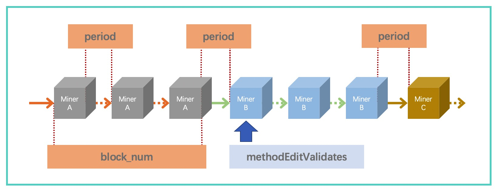

PoA类共识
==========
在本系统中，我们把PoA和搭载Chained-BFT的XPoA统称为PoA类共识，该共识的实现在 ``/bcs/consensus/xpoa`` 文件夹下。
PoA类共识是 XuperChain 对PoA的一种实现，其基本思想是在节点中动态设定一组验证节点，验证节点组在预设的时间段内进行组内轮流出块。

PoA类共识支持动态变更验证节点，可以通过指令修改现有的验证节点组，包括对当前验证节点组进行删除和添加操作。在该算法中，预设时间段包括确定单个区块的出块时间，以及验证节点单次轮值出块数量。 同样，XPoA通过Chained-BFT算法来保证轮值期间的安全性。

时间片划分
------------

验证者集合变更
-----------------
**1. 验证者变更**

PoA类共识推荐使用在联盟链场景中，尤其是XPoA非常适合该场景。PoA类共识通过系统合约变更验证者集合，与TDPoS不同的是，验证者集合将实时变更，而不是等到下一个Term。PoA类发起变更要求一个符合规则的ACL账户，具体要求如下。

- 当前验证者集合地址的50%至少需要出现在ACL账户成员列表中，并且这些账户的权重需要超过阈值。

- 详情请见 ``/bcs/consensus/xpoa`` 文件夹下 ``kernel_contract.go`` 的 ``isAuthAddress`` 函数。

- 上述更改交易上链后，验证者集合并不会立即变更，而是在三个区块后集合才能生效（确保该块不会被回滚）。

- 我们推荐PoA类共识的ACL账户设置为所有验证者成员均分权重的联合账户，这样超过半数以上签名即可达到变更权限要求。

.. code-block:: bash
    :linenos:

    "genesis_consensus":{
        "name": "xpoa", // PoA类共识统称
        "config": {
            "period":3000,  // 【重要】每个块生产固定时间，单位为毫秒，示例所示为3s一个块
            "block_num":40, // 【重要】每个候选人在一轮轮数中需要出块的数目
            "init_proposer": {
                "address" : ["TeyyPLpp9L7QAcxHangtcHTu7HUZ6iydY", "SmJG3rH2ZzYQ9ojxhbRCPwFiE9y6pD1Co"]  // 【重要】数组中记录了全部初始候选人节点的address
            }
        }
    }

PoA类共识的时间片轮转如下。

    PoA类时间片划分示意图

**2. 技术细节**

 ``/bcs/consensus/xpoa`` 文件夹下的 ``kernel_contract.go`` 文件包含上述变更流程的实现。

.. code-block:: go
    :linenos:

    验证者集合变更
    func (x *xpoaConsensus) methodEditValidates(contractCtx contract.KContext) (*contract.Response, error)

    验证者集合查询
    func (x *xpoaConsensus) methodGetValidates(contractCtx contract.KContext) (*contract.Response, error)

