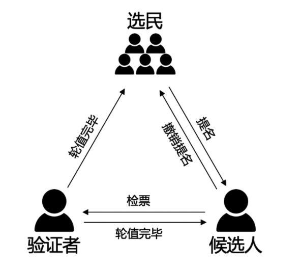
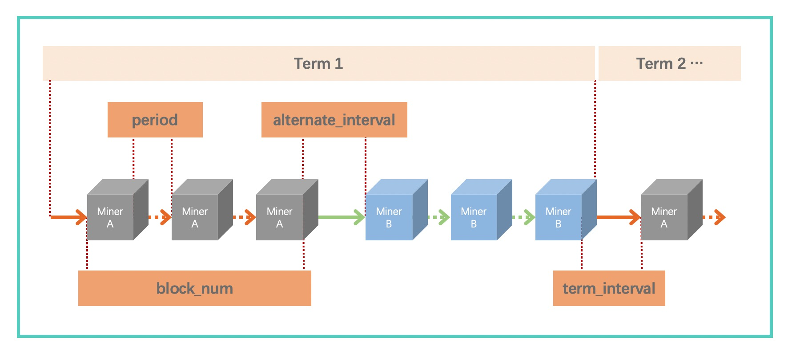

TDPoS类共识
============
在本系统中，我们把TDPoS和搭载Chained-BFT的XPoS统称为TDPoS类共识，该共识的实现在 ``/bcs/consensus/tdpos`` 文件夹下。TDPoS类共识在选举流程上完全相同，唯一的区别在于XPoS会限制账本回滚的高度，更适用于联盟链，以确保上层业务可靠。

角色转换
--------
TDPoS类共识是 XuperChain 的一种改进型的DPoS算法，它在一段预设的时间长度（被称为Term）内通过投票选择N个验证节点（验证者/验证人集合），同时将这样一轮区块生产周期分为N个时间段， 这若干个验证者按照约定的时间段协议协同挖矿的一种算法。综上，整个TDPoS类共识主要包括2大阶段：

- 验证人选举：通过pos相关选举规则选出一个验证者集合。

- 验证人轮值：验证者集合按照约定的协议规则进行区块生产。

    TDPoS类共识角色转换示意图

在XPoS中，网络中的节点有三种角色，分别是“普通选民”、“候选人”、“验证者”：

- 选民：所有节点拥有选民的角色，可以对候选节点进行投票；

- 候选人：需要参与验证人竞选的节点通过注册机制成为候选人，通过注销机制退出验证人竞选；

- 验证人：每轮第一个节点进行检票，检票最高的topK候选人集合成为该轮的验证人，被选举出的每一轮区块生产周期的验证者集合，负责该轮区块的生产和验证，某个时间片内，会有一个矿工进行区块打包，其余的节点会对该区块进行验证。

时间片划分
-----------
TDPoS类共识矿工轮转通过时间片来划分，当验证人确定之后，在验证人未被更改之前，所有验证节点全部按照配置规则进行轮转，我们以创世块配置tdpos.json来介绍。

.. code-block:: bash
    :linenos:

    "genesis_consensus":{
	    "name": "tdpos",
	    "config": {
            "timestamp": "1559021720000000000",   // 开始时间，可忽略
            "proposer_num": "2",   // 验证人集合总人数
            "period": "3000",   // 每个块生产固定时间，单位为毫秒，示例所示为3s一个块
            "alternate_interval": "3000",   // 同一轮矿工切换间隙时间
            "term_interval": "6000",    // term切换间隙时间
            "block_num": "20",  // 每个验证人在一轮轮数中需要出块的数目
            "vote_unit_price": "1", // 计票单位
            "init_proposer": {
                "1": ["TeyyPLpp9L7QAcxHangtcHTu7HUZ6iydY", "SmJG3rH2ZzYQ9ojxhbRCPwFiE9y6pD1Co"] // 数组中记录了全部初始验证人节点的address
            }
        }
    }

    TDPoS类时间片划分示意图

为了降低切主时容易造成分叉，TDPoS类共识将出块间隔分成了3个，如上图所示：

- period：同一轮内同一个矿工的出块间隔；

- alternate_interval：同一轮内切换矿工时的出块间隔，需要为period的整数倍；

- term_interval：不同轮间切换时的出块间隔，需要为period的整数倍；

提名和投票
-----------
**1. 提名**

节点想要参与竞选，需要先被提名到候选人池，只有被提名的地址才能接受投票。系统中所有拥有 **治理Token** 的节点均可参与提名和投票。为了收敛候选人集合，并一定程度上增加候选人参与的门槛，提名为候选人会有很多规则，主要有以下几点：

- 提名候选人需要治理Token，详见 `治理Token <../governance.html#xuperchain>`_ 。

- 该治理Token会被一直冻结，直到节点退出候选池。

- 提名支持自提和他提，即允许第三方节点对候选人进行提名。

- 被提名者需要知晓自己被提名，需要对提名交易进行签名。

- 提名的节点可以通过撤销提名来结束流程，撤销之后和该节点相关的选票都会被撤销，相关治理Token将会被赎回。

**2. 投票**

候选人被提名为候选人后，会形成一个候选人池，投票需要针对该池子内部的节点进行。投票也有很多规则，主要有以下几点：

- 任何有治理Token的地址都可以进行投票，投票需要冻结治理Token。

- 该治理Token会被一直冻结，直到该投票被撤销。投票的节点可以撤销投票来赎回自己的治理Token。

**3. 技术细节**

 ``/bcs/consensus/tdpos`` 文件夹下的 ``kernel_contract.go`` 文件包含上述提名和投票流程的实现。

.. code-block:: go
    :linenos:

    执行提名候选人
    func (tp *tdposConsensus) runNominateCandidate(contractCtx contract.KContext) (*contract.Response, error) 
       
    执行候选人撤销,仅支持自我撤销 
    func (tp *tdposConsensus) runRevokeCandidate(contractCtx contract.KContext) (*contract.Response, error) 
        
    执行投票
    func (tp *tdposConsensus) runVote(contractCtx contract.KContext) (*contract.Response, error)

    执行选票撤销
    func (tp *tdposConsensus) runRevokeVote(contractCtx contract.KContext) (*contract.Response, error)

