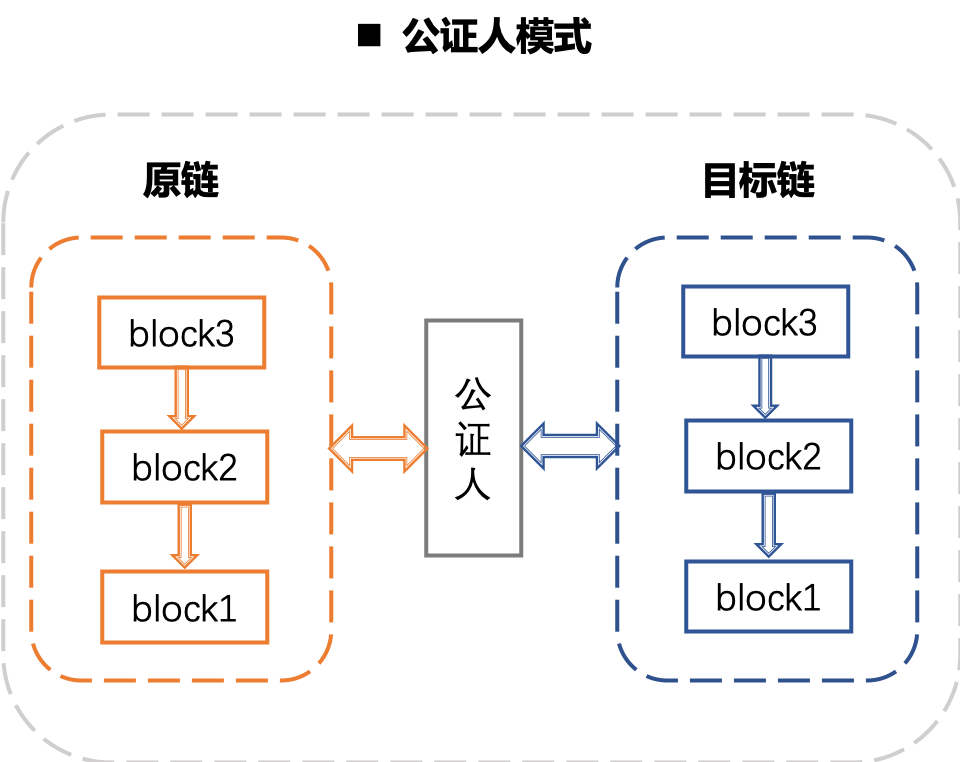
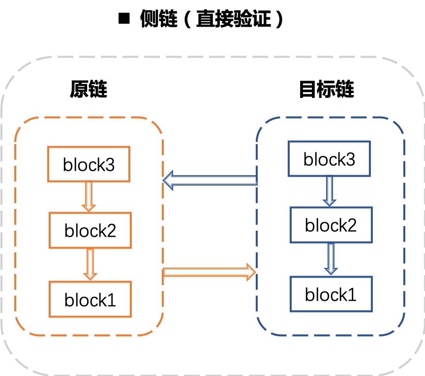
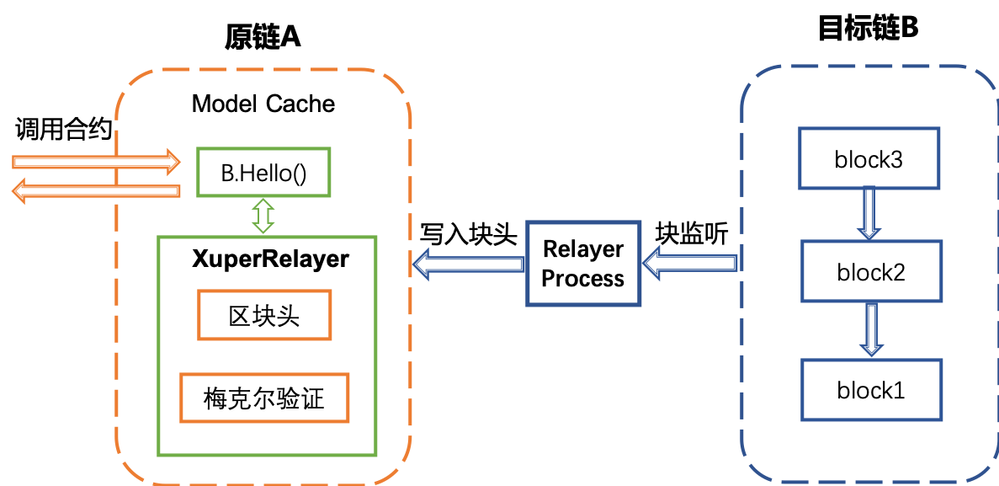
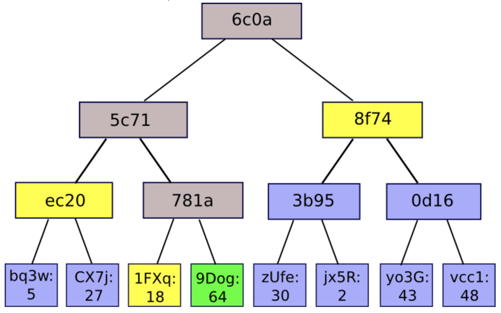

XuperChain 跨链技术
===================

背景
---------

近年来，随着区块链行业的蓬勃发展，产生了很多区块链系统，这些系统底层协议各不相同。并且随着区块链被被纳入新基建的范畴， 如火如荼的区块链改造运动更加活跃，正在形成一个个新的数据孤岛无论这些孤岛是基于相同的底层系统还是不同的底层系统，其数据互通都非常困困难，因此，迫切需要一个解决方案能够系统地解决多链之间融合的问题，从而实现不同链之间地价值互通。

什么是跨链
-----------------

跨链（Cross-Chain），简单来说就是通过一定的技术措施实现相对独立的不同区块链系统之间数据和资产的链接互通。常见的跨链解决方案一般是针对资产类，实现不同链之间任意数据的跨链互通难度会更高

常见的跨链互操作类型
^^^^^^^^^^^^^^^^^^^^^^^^^^^^^

跨链资产互换
>>>>>>>>>>>>>>>>>>>
.. image:: ../images/cross_chain_1.png
    :align: center

跨链资产转移
>>>>>>>>>>>>>>>>>>>>
.. image:: ../images/cross_chain_2.png
    :align: center

跨链任意数据
>>>>>>>>>>>>>>>>>>
.. image:: ../images/cross_chain_3.png
    :align: center

主流跨链方案
-------------------

跨链技术的主要挑战
^^^^^^^^^^^^^^^^^^^^^^^^^

    - 生效的原子性
      对两个网络分别发起交易tx1、交易tx2，如何保证要么都不生效，要么都生效。可以通过经典的两阶段提交来完成， 两个交易互为锚点，锚点超过一段时间仍然无效，就可以发起对交易的回滚。

    - 锚点有效性校验
      所有节点对锚点的有效性达成没有分歧的判断，不能依赖远程访问证明，由于网络不稳定因素可能会造成验证难的问题。

    - 合约验证的不确定性
      一般的区块链系统，每个节点都会验证交易，以防止作恶。所以如果一个合约嵌入了外部链的合约调用，那么在验证阶段，如何确保各个节点验证的结果的一致性，是否会依赖外链的稳定性，这些问题都需要解决。

主流的跨链方案
^^^^^^^^^^^^^^^^^^^^^^^^^

一般地通过哈希时间锁可以保证跨链交易的原子性。对于两个比较独立的区块链系统，一般的需要依赖一个第三方组件实现信息的交互。根据第三方组件是否执行验证可以分为两种模式，分为公证人模式、侧链/中继模式和哈希锁定模式。根据不同链的交易是异步生效还是同步生效，可以分为异步模式和同步模式。

公证人模式
>>>>>>>>>>>>>>>

由一个或者一组节点作为公证人参与到两条链中，进行双方交易的收集和验证。其优点是简单，缺点是弱中心化，如下图所示：

侧链/中继模式
>>>>>>>>>>>>>>>>>

侧链/中继链模式是2014年BlockStream提出的一种跨链方案。其与公证人模式最大的区别在于其验证是在目标链进行，通过双向锚定的方式实现资产在不同链之间的转移。目标链的验证方式各不相同，比如BTC-Relay使用的是SPV技术。

异步模式
>>>>>>>>>>>>>>

以太坊上很多预言机类的DApp的实现方式采用的是异步模式。简单来说，是指发起调用的是一个函数，处理调用结果的是另一个回调函数，如下图所示：

.. image:: ../images/cross_chain_6.png
    :align: center

异步调用场景下，一个完整流程需要3笔交易：首先发送交易tx1到A链，A链代码执行到跨链调用会发出一个事件，并且声明了回调函数。

由一个中间件（单例）订阅到事件后，发起对B链调用的交易tx2，tx2上链成功后， 中间件在触发回调函数调用Tx3.

异步的缺点是业务逻辑被迫拆成很多碎片，交互次数多，编程不友好。

同步模式
>>>>>>>>>>>>>>
同步模式目前业界没有比较统一的方案，一般地区块链的上的合约在每个节点都会重复执行，如何保证重复执行的结果确定性，且具备幂等性、无副作用是一个难解决的问题。但是现在很多区块链系统采取的是预执行再提交的方式，比如 XuperChain 和Fabric，基于这种事务模式比较容易同步模式的跨链，下面是同步模式的示意图：

.. image:: ../images/cross_chain_7.png
    :align: center

XuperChain 跨链方案
-----------------------
 XuperChain 是一个易于编程的区块链框架，可以方便地定制新的功能。基于此框架， XuperChain 设计了一个轻量级的跨链方案，通过合约和一些基础库组成了一个完整的跨链方案，适用于不同的跨链应用场景。

.. image:: ../images/cross_chain_8.png
    :align: center

 XuperChain 的跨链方案主要包括3层， 分别是基础库层、账本层和合约层。其中基础库层和账本层属于 XuperChain 的内核层，是 XuperChain 框架提供的一些基础能力，包括跨链域名解析协议、梅克尔proof校验、异构区块头解析协议、事务预锁定等。合约层是使用用户合约实现的合约基础库，主要是区块头管理合约、链名解析合约、去中心化身份管理等能力。通过这些功能套件的组装，我们可以应用于不同的使用场景。

通过对用户实际需求的调研，我们抽象出三种不同的跨链场景，分别是只读事务场景跨链、非事务场景跨链和事务场景跨链。并通过上述合约和基础库的能力设计了满足不同场景的解决方案，下面会进行详细的介绍。

跨链域名解析
^^^^^^^^^^^^^^^^^^^
跨链涉及到不同链资源的互操作，由于不同的链的协议各部相同，为了实现对不同链的资源进行统一定义， XuperChain 定义了如下跨链寻址协议，结合着链名解析合约，便可以实现对任何协议链的统一资源寻址。

跨链寻址协议
>>>>>>>>>>>>>>>>>

.. code-block:: c++
	:linenos:
	
	    [chain_scheme:][//chain_name][path][?query]
		
- chain_scheme：跨链链类型标识符，用于标识链的具体类型，比如： xuper 表示所跨链链接的链的类型是 XuperChain 。
- chain_name：所跨链的链名，定位某一个具体的链，同一Scheme下链名是唯一的；
- path：不同Scheme的链类型扩展字段；
- query：用于定位某个链内的某项资源，比如对于 XuperChain ，声明调用的合约名、方法名和参数等信息；
	
	下面举例说明：
	::
		
		xuper://chain1?module=wasm&bcname=xuper&contract_name=counter&method_name=increase
		xuper: 表示被访问的目标链为XuperChain；
		chain1: 表示被访问的目标链的链名；
		module: 表示被访问目标xuper链被访问合约的vm为wasm;
		bcname: 表示被访问目标xuper链的子链名；
		contract_name: 表示被访问目标xuper链合约名；
		method_name：表示被访问目标xuper链合约方法名；
		
目前 XuperChain 仅开源了 XuperChain 搭建的网络之间的跨链互操作，后续会逐步开源与其他链之间的互操作能力。

链名解析合约
>>>>>>>>>>>>>>>>>

为了实现跨链请求，仅有上面的链名跨链寻址协议是不够的，在跨链发起的原链上还需要部署一个链名解析合约，该合约目前也已开源 `链名解析合约 <https://github.com/xuperchain/xuperchain/blob/master/core/contractsdk/cpp/example/naming/src/naming.cc>`_。

.. code-block:: go
	:linenos:
		
	// 注册一个网络，同时包含网络初始meta信息
	RegisterChain(name, chain_meta)  
	// 更新一个网络的meta信息，比如修改网络的背书策略
	UpdateChain(name, chain_meta)  
	// 根据网络名解析所有背书节点
	Resolve(chain_name) *CrossQueryMeta 
	// 插入一个背书节点
	AddEndorsor(chain_name, info) 
	// 更新背书节点信息
	UpdateEndorsor(chain_name, address, info)
	// 删除背书节点
	DeleteEndorsor(chain_name, address) 
	// 目标网络meta信息
	message CrossChainMeta {
		string type = 1;
		int64 min_endorsor_num = 2;
	}
	// 目标网络背书信息
	message CrossEndorsor {
		string address = 1;
		string pub_key = 2;
		tring host = 3;   // ip+port
	}
	// 目标网络CrossQuery完整信息
	message CrossQueryMeta {
		CrossChainMeta chain_meta = 1;
		repeated CrossEndorsor endorsors = 2;
	}
	
只读事务场景跨链
^^^^^^^^^^^^^^^^^^^^^^^^^
整体方案
>>>>>>>>>>>>

在大部分使用场景下，用户仅希望从一个链能够查询到另一个链的数据，并且能够满足稳定性、幂等性和安全性，我们称为只读事务跨链。

只读事务跨链的典型场景包括身份认证、资质认证等；

为了满足上述要求，我们采取了目标链背书的方式，如下图所示：

.. image:: ../images/cross_chain_9.png
    :align: center

完整的步骤如下：

1. 用户在原链发起预执行，合约内部调用”cross_query”原语，访问目标链Hello()合约；
#. 原链内部解析到”cross_query”原语后会调用跨链寻址合约解析目标链链接和背书信息；
#. 原链访问目标链的背书服务；
#. 目标链背书服务内部访问Hello()合约，得到Response并进行签名，返回给原链；
#. 原链继续执行合约，并返回预执行结果给用户；
#. 用户组装完整的交易提交给原链网络；

背书和验证
>>>>>>>>>>>>>>>>>>>
 XuperChain 的合约采用的是先预执行再提交的二阶段处理过程，参看 （https://xuperchain.readthedocs.io/zh/latest/design_documents/XuperModel.html）。

**预执行阶段**，原链节点会远程访问目标链背书服务，背书服务会预执行该合约并且对合约结果进行签名背书，原链会将该合约的结果和背书信息写进写集中一个特殊的bucket中。

**提交阶段**，不需要再进行远程调用，原链节点在验证合约时，首先会解析出该特殊的写集中的跨链结果和背书签名信息，以填充合约执行的上下文环境，当执行到只读跨链原语时，原链节点不再进行远程调用，而是验证预执行的背书签名，当签名满足背书策略的要求后，就直接使用写集中的跨链合约结果继续后续的合约逻辑，否则验证失败。

使用说明
>>>>>>>>>>>>>>

	https://xuperchain.readthedocs.io/zh/latest/advanced_usage/readonly_queries.html

非事务场景跨链
^^^^^^^^^^^^^^^^^^^^^^

什么是非事务性场景跨链
>>>>>>>>>>>>>>>>>>>>>>>>>>>>>>
非事务场景跨链是指跨链行为并不是要求不同链上的交易具备事务性，即不要求不同链上的跨链交易同时生效或同时失败，跨链交易只对当时被跨链的交易状态进行确认，并根据目标交易状态执行交易后续操作。

举例来讲，在A链上发起的交易tx1执行成功后，发起B链上的交易tx2，但tx2执行失败并不会影响tx1，即不会发生tx1回滚。这种存在依赖的交易，但不保证多个交易执行满足事务性的场景，是典型的非事务跨链。

非事务跨链的典型场景比如身份验证、预言机、资产跨链转移等等，在技术上主要强调跨链交易的存在性证明，但对跨链交易的原子性没有要求。

整体方案
>>>>>>>>>>>>>>>>

非事务跨链典型技术是通过中继实现对目标链数据的数据同步和交易存在性验证，类似BTCRelay。在 XuperChain 中，我们也实现了一套中继机制，通过对目标链的区块头同步，以及梅克尔验证技术，可以做到在原链上直接验证目标链的交易是否存在。

如下图是中继机制的整体结构，主要分为以下两个部分：
	- **链上中继合约(XuperRelayer)**：部署在原链上的一个智能合约，会保存目标链的所有块头信息，并提供基于梅克尔证明的目标链交易存在性验证。
	- **中继同步进程(Relay Process)**：在目标链和原链之间，会有一个或多个中继进程，持续监听目标链的最新出块信息，并抽取出块头信息写入

以一个典型的资产转移的场景为例，首先在B链上发起tx1交易，然后原链上发起tx2交易。tx2交易成功的前提条件是确认tx1交易已经生效。因此整个跨链交易生效流程：

    1. 用户首先在目标链提交tx1交易；
    2. 当tx1交易打包在块中后，中继同步进程会将块头同步到原链上，并保存在链上中继合约中；
    3. 用户在原链上发起资产转移交易tx2，同时在合约参数中填写tx1的信息以及tx1的梅克尔路径；
    4. 原链中的用户合约通过跨合约调用调用链上中继合约，进行梅克尔验证，如果证明tx1确实存在在目标链中，则返回验证成功，否则返回验证失败；
    5. 用户合约在拿到tx1验证成功的结果后，执行后续资产转移操作，并返回结果。
	
梅克尔证明
>>>>>>>>>>>>>>

在 XuperChain 中，区块头保存了块中所有交易的txid构造出的梅克尔树的树根。下图是一颗区块中的梅克尔树举例，区块中的8个交易是梅克尔树的叶子节点，按照交易顺序，每两个相邻的交易的txid通过SHA256计算出梅克尔树的父节点id，依次向上直到计算出了梅克尔树根。在这个树形结构中，任何一个节点的id都直接和自己的父子节点相关，因此树中任何一个节点数据的修改，都会导致整个梅克尔树的树根变化。

交易的验证方只需要知道待验证交易tx1的txid，tx1所在块的block1，并知道从tx1所在梅克尔树的叶子节点开始到梅克尔树根的路径上所有兄弟节点的hash值，就可以计算出梅克尔树根。例如我们要验证梅克尔树中绿色节点9Dog的存在性，那么我们同时给出从9Dog到梅克尔树根的路径上的所有兄弟节点数组[1FXq, ec20, 8f74]，则从下而上:

.. code-block:: go
    :linenos:
	
	Hash(1FXq+9Dog) ⇒ 781a
    Hash(ec20+781a) ⇒ 5c71
    Hash(5c71+8f74) ⇒ 6c0a
	

在得到计算出的根Hash后，我们从链上中继合约中获取之前已经保存的block1对应的区块头中的梅克尔树根，如果也是6c0a则证明验证通过，否则验证不通过。

链上中继合约
>>>>>>>>>>>>>>>>>>

链上中继合约是跨链存在性证明的核心，提供对目标链中的区块头同步存储，并通过梅克尔验证技术提供交易查询接口。链上中继合约主要解决三个问题，交易的真实性、及时性证明、区块头分叉管理。

	- **真实性证明**：即证明交易确实存在，主要通过Merkle Proof证明交易是否真的存在于链中以及是否在主干上。
	- **及时性证明**：即证明交易是否确认，跟目标链采用的共识算法相关。对于同步Byzantine类共识算法，及时性是内置的，只要交易在区块头中，那么交易必定在原链处于上链状态。对于PoW类共识算法，一般要求交易所在块距主干最新高度相差6个块以上。
	- **区块头分叉管理**：对同步的区块头按照树形结构维护依赖关系，并根据目标链的主干选择算法即使调整目标链的主干区块状态。
	
目前的跨链实现支持了对 XuperChain 同构链的链上中继合约，代码位于 https://github.com/xuperchain/xuperchain/tree/master/core/contractsdk/cpp/example/xuper_relayer 目录中。主要实现了对XPoS共识的区块头分叉管理和存在性证明，目前该功能仍处于实验状态，后续版本中会持续增加新的共识和异构链的支持。

合约主要接口如下：

+-----------------+------------------------------+------------------------------------------------------------------+
|     接口名      |              参数            |                               说明                               |
+=================+==============================+==================================================================+
|initialize       |无                            |合约初始化函数                                                    |
+-----------------+------------------------------+------------------------------------------------------------------+
|initAnchorBlockHe|blockHeader: 区块头数据       |初始化锚点区块头，锚点区块头一般是初始化后写入的第一个区块头，目  |
|ader             |                              |标链不一定需要从创世块开始同步，因此有了锚点区块的概念。          |
+-----------------+------------------------------+------------------------------------------------------------------+
|putBlockHeader   |blockHeader: 区块头数据       |写入一个新区块头信息，会自动验证区块头数据是否正确并进行分叉管理  |
+-----------------+------------------------------+------------------------------------------------------------------+
|verifyTx         |blockid: 待验证交易的区块id   |交易验证接口，通过梅克尔证明验证他链上的交易id是否真实有效        |
|                 |txid:待验证的交易id           |                                                                  |
|                 |proofPath:待验证交易的梅克尔路|                                                                  |
|                 |径上的兄弟节点hash            |                                                                  |
|                 |txIndex:待验证交易在区块所有交|                                                                  |
|                 |易中的序号                    |                                                                  |
+-----------------+------------------------------+------------------------------------------------------------------+
|printBlockHeader |blockid: 区块id               |打印指定区块id的区块头信息                                        |
+-----------------+------------------------------+------------------------------------------------------------------+

中继同步进程
>>>>>>>>>>>>>>>>>
中继同步进程相对简单，主要通过对目标链的出块监听，将最新区块中的区块头信息抽取出来，并同步到原链中。
中继同步进程的代码位于https://github.com/xuperchain/xuperchain/tree/master/core/cmd/relayer。

使用说明
>>>>>>>>>>>>>>

	https://xuperchain.readthedocs.io/zh/latest/advanced_usage/cross_chain.html

事务场景跨链
>>>>>>>>>>>>>>>

