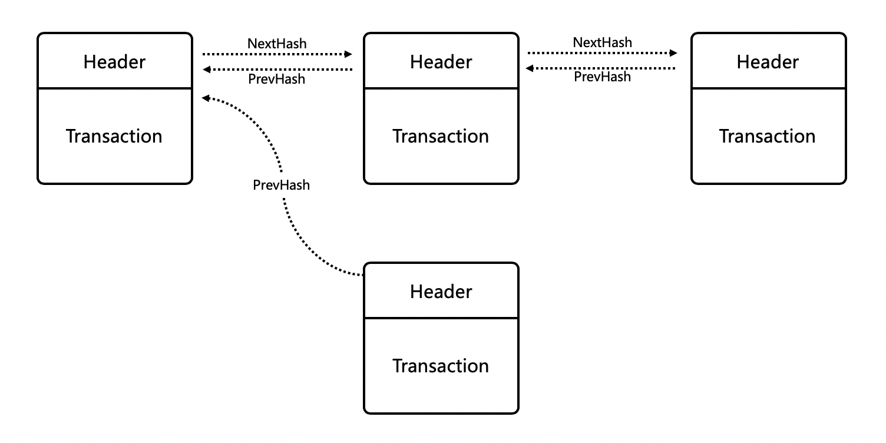

账本状态机
=============

众所周知，程序=数据结构+算法，了解一个程序的数据结构有助于掌握一个程序的关键设计。本文从背景、功能以及各个字段的用意来剖析XuperChain底层账本的核心数据结构，从而方便XuperChain开发者以及用户更深入地了解XuperChain底层框架的核心数据结构的设计缘由，有助于提高XuperChain开发者更高效的开发，有助于XuperChain用户更好的使用XuperChain来服务自己的业务。

核心数据结构
------------

涉及到账本的核心数据结构包括：区块、交易、UTXO、读写集。

区块
^^^^

- 背景：所谓区块链，简单来说就是不同的区块以DAG方式链接起来形成的链。因此，区块是区块链的基本单元。
- 功能：区块是区块链的基本单元，通常为了提高区块链网络的吞吐，矿工会在一个区块中打包若干个交易。一个区块通常由区块头以及区块体组成。

- 代码：区块的Proto如下

.. code-block:: protobuf
    :linenos:

    message InternalBlock {
        // block version
        // 区块版本
        int32 version = 1;
        // Random number used to avoid replay attacks
        // 随机数，用来避免重放攻击
        int32 nonce = 2;
        // blockid generate the hash sign of the block used by sha256
        // 区块的唯一标识
        bytes blockid = 3;
        // pre_hash is the parent blockid of the block
        // 区块的前置依赖区块ID
        bytes pre_hash = 4;
        // The miner id
        // 矿工ID
        bytes proposer = 5;
        // 矿工对区块的签名
        // The sign which miner signed: blockid + nonce + timestamp
        bytes sign = 6;
        // The pk of the miner
        // 矿工公钥
        bytes pubkey = 7;
        // The Merkle Tree root
        // 默克尔树树根
        bytes merkle_root = 8;
        // The height of the blockchain
        // 区块所在高度
        int64 height = 9;
        // Timestamp of the block
        // 打包区块的时间戳
        int64 timestamp = 10; 
        // Transactions of the block, only txid stored on kv, the detail information
        // stored in another table
        // 交易内容
        repeated Transaction transactions = 11; 
        // The transaction count of the block
        // 区块中包含的交易数量
        int32 tx_count = 12; 
        // 所有交易hash的merkle tree
        repeated bytes merkle_tree = 13; 
        // 采用DPOS共识算法时，当前是第几轮
        int64 curTerm = 16; 
        int64 curBlockNum = 17; 
        // 区块中执行失败的交易以及对应的失败原因
        map<string, string> failed_txs = 18; // txid -> failed reason
        // 采用POW共识算法时，对应的挖矿难度值
        int32 targetBits = 19; 
        // 下面的属性会动态变化
        // If the block is on the trunk
        // 该区块是否在主干上
        bool in_trunk = 14; 
        // Next next block which on trunk
        // 当前区块的后继区块ID
        bytes next_hash = 15; 
    }

交易
^^^^

- 背景：区块链网络中的每个节点都是一个状态机，为了给每个节点传递状态，系统引入了交易，作为区块链网络状态更改的最小操作单元。
- 功能：通常表现为普通转账以及智能合约调用。
- 代码：交易的Proto如下

.. code-block:: protobuf
    :linenos:

    message Transaction {
        // txid is the id of this transaction
        // 交易的唯一标识
        bytes txid = 1;
        // the blockid the transaction belong to
        // 交易被打包在哪个区块中
        bytes blockid = 2;
        // Transaction input list
        // UTXO来源
        repeated TxInput tx_inputs = 3;
        // Transaction output list
        // UTXO去处
        repeated TxOutput tx_outputs = 4;
        // Transaction description or system contract
        // 交易内容描述或系统合约
        bytes desc = 6;
        // Mining rewards
        // 矿工奖励
        bool coinbase = 7;
        // Random number used to avoid replay attacks
        // 随机数
        string nonce = 8;
        // Timestamp to launch the transaction
        // 发起交易的时间戳
        int64 timestamp = 9;
        // tx format version; tx格式版本号
        int32 version = 10; 
        // auto generated tx
        // 该交易是否属于系统自动生成的交易
        bool autogen = 11; 
        // 读写集中的读集
        repeated TxInputExt tx_inputs_ext = 23; 
        // 读写集中的写集
        repeated TxOutputExt tx_outputs_ext = 24; 
        // 该交易包含的合约调用请求
        repeated InvokeRequest contract_requests = 25; 
        // 权限系统新增字段
        // 交易发起者, 可以是一个Address或者一个Account
        string initiator = 26; 
        // 交易发起需要被收集签名的AddressURL集合信息，包括用于utxo转账和用于合约调用
        repeated string auth_require = 27; 
        // 交易发起者对交易元数据签名，签名的内容包括auth_require字段
        repeated SignatureInfo initiator_signs = 28; 
        // 收集到的签名
        repeated SignatureInfo auth_require_signs = 29; 
        // 节点收到tx的时间戳，不参与签名
        int64 received_timestamp = 30; 
        // 统一签名(支持多重签名/环签名等，与initiator_signs/auth_require_signs不同时使用)
        XuperSignature xuper_sign = 31; 
    }

UTXO
^^^^

- 背景：区块链中比较常见的两种操作，包括普通转账以及合约调用，这两种操作都涉及到了数据状态的引用以及更新。为了描述普通转账涉及到的数据状态的引用以及更新，引入了UTXO(Unspent Transaction Output)。
- 功能：一种记账方式，用来描述普通转账时涉及到的数据状态的引用以及更新。通常由转账来源数据(UtxoInput)以及转账去处数据(UtxoOutput)组成。

.. image:: ../images/tx-img.png
    :align: center

- 代码：UTXO的Proto如下

.. code-block:: protobuf
    :linenos:

    message Utxo {
        // 转账数量
        bytes amount = 1;
        // 转给谁
        bytes toAddr = 2;
        // 转给谁的公钥
        bytes toPubkey = 3;
        // 该Utxo属于哪一个交易
        bytes refTxid = 4;
        // 该Utxo数据哪一个交易的哪一个offset
        int32 refOffset = 5;
    }
    // UtxoInput query info to query utxos
    // UTXO的转账来源
    message UtxoInput {
        Header header = 1;
        // which bcname to select
        // UTXO来源属于哪一条链
        string bcname = 2;
        // address to select
        // UTXO来源属于哪个address
        string address = 3;
        // publickey of the address
        // UTXO来源对应的公钥
        string publickey = 4;
        // totalNeed refer the total need utxos to select
        // 需要的UTXO总额
        string totalNeed = 5;
        // userSign of input
        // UTXO来源的签名
        bytes userSign = 7;
        // need lock
        // 该UTXO是否需要锁定(内存级别锁定)
        bool needLock = 8;
    }
    // UtxoOutput query results
    // UTXO的转账去处
    message UtxoOutput {
        Header header = 1;
        // utxo list
        // UTXO去处
        repeated Utxo utxoList = 2;
        // total selected amount
        // UTXO去处总额
        string totalSelected = 3;
    }

读写集
^^^^^^

- 背景：区块链中比较常见的两种操作，包括普通转账以及合约调用，这两种操作都涉及到了数据状态的引用以及更新。为了描述合约调用涉及到的数据状态的引用以及更新，引入了读写集。
- 功能：一种用来描述合约调用时涉及到的数据状态的引用以及更新的技术。通常由读集(TxInputExt)以及写集(TxOutputExt)组成。

.. image:: ../images/xupermodel.png
    :align: center

- 代码：读写集的Proto如下

.. code-block:: protobuf
    :linenos:

    // 扩展输入
    message TxInputExt {
        // 读集属于哪一个bucket
        string bucket = 1;
        // 读集对应的key
        bytes key = 2;
        // 读集属于哪一个txid
        bytes ref_txid = 3;
        // 读集属于哪一个txid的哪一个offset
        int32 ref_offset = 4;
    }
    // 扩展输出
    message TxOutputExt {
        // 写集属于哪一个bucket
        string bucket = 1;
        // 写集对应的key
        bytes key = 2;
        // 写集对应的value
        bytes value = 3;
    }

XuperModel
----------

XuperChain能够支持合约链内并行的很大的原因是由于其底层自研的XuperModel数据模型。

XuperModel是一个带版本的存储模型，支持读写集生成。该模型是比特币utxo模型的一个演变。在比特币的utxo模型中，每个交易都需要在输入字段中引用早期交易的输出，以证明资金来源。同样，在XuperModel中，每个事务读取的数据需要引用上一个事务写入的数据。在XuperModel中，事务的输入表示在执行智能合约期间读取的数据源，即事务的输出来源。事务的输出表示事务写入状态数据库的数据，这些数据在未来事务执行智能合约时将被引用，如下图所示：

.. figure:: ../images/xupermodel.png
    :alt: XuperModel事务
    :align: center
    
    XuperModel事务

为了在运行时获取合约的读写集，在预执行每个合约时XuperModel为其提供智能缓存。该缓存对状态数据库是只读的，它可以为合约的预执行生成读写集和结果。验证合约时，验证节点根据事务内容初始化缓存实例。节点将再次执行一次合约，但此时合约只能从读集读取数据。同样，写入数据也会在写入集中生效。当验证完生成的写集和事务携带的写集一致时合约验证通过，将事务写入账本，cache的原理如下所示，图中左边部分是合约预执行时的示意图，右边部分是合约验证时的示意图：

.. figure:: ../images/xupermodel_contract.png
    :alt: XuperModel合约验证
    :align: center
    
    XuperModel合约验证