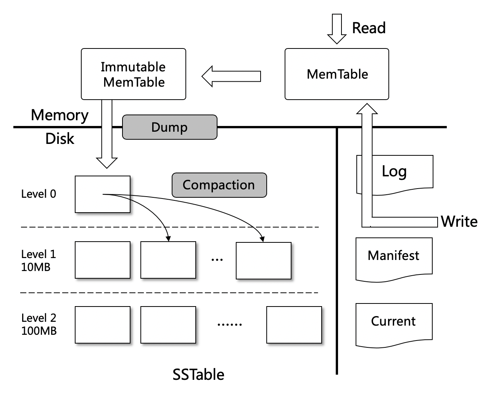

多盘散列
========

背景
----

区块链中的账本数据通常是只增不减，而单盘存储容量有上限。目前单盘最高容量是14TB左右，需要花费4000块钱；以太坊账本数据已经超过1TB，即使是在区块大小上精打细算的比特币账本也有0.5TB左右。区块链账本数据不断增加，单盘容量上限成为区块链持续发展的天花板。
目前对leveldb的多盘扩展方案，大部分是采用了多个leveldb实例的方式，也就是每个盘一个单独的leveldb实例。这种做法的好处是简单，不需要修改leveldb底层代码，缺点是牺牲了多行原子写入的功能。在区块链的应用场景中，我们是需要这种多个写入操作原子性的。所以选择了改leveldb底层模型的技术路线。

LevelDB数据模型分析
-------------------

- **Log文件**：写Memtable前会先写Log文件，Log通过append的方式顺序写入。Log的存在使得机器宕机导致的内存数据丢失得以恢复；
- **Manifest文件**：Manifest文件中记录SST文件在不同Level的分布，单个SST文件的最大最小key，以及其他一些LevelDB需要的元信息；
- **Current文件**：LevelDB启动时的首要任务就是找到当前的Manifest，而Manifest可能有多个。Current文件简单的记录了当前Manifest的文件名；

以上3种文件可以称之为元数据文件，它们占用的存储空间通常是几十MB，最多不会超过1GB

- **SST文件**：磁盘数据存储文件。分为Level 0到Level N多层，每一层包含多个SST文件；单个SST文件容量随层次增加成倍增长；文件内数据有序；其中Level0的SST文件由Immutable直接Dump产生，其他Level的SST文件由其上一层的文件和本层文件归并产生；SST文件在归并过程中顺序写生成，生成后仅可能在之后的归并中被删除，而不会有任何的修改操作。

核心改造点
----------

Leveldb的数据主要是存储在SST(Sorted String Table)文件中，写放大的产生就是由于compact的时候需要顺序读取Level-N中的sst文件，写出到Level-N+1的sst文件中。
我们将SST文件分散在多块盘上存储，具体的方法是根据sst的编号做取模散列，取模的底数是盘的个数， 理论上数据量和IO压力会均匀分散在多块盘上。

举个例子，假设某sst文件名是12345.ldb，而节点机器有3块盘用于存储（/disk1, /disk2, /disk3)，那么就将改sst文件放置在 (12345 % 3) + 1, 也就是disk1盘上

使用方式
--------

leveldb.OpenFile 有两个参数，一个是db文件夹路径path，一个是打开参数Options；
如果要使用多盘存储，调用者需要设置 Options.DataPaths 参数，它是一个[]string 数组，声明了各个盘的文件夹路径，可参考 `配置多盘存储 <../advanced_usage/multi-disks.html#multi-disk>`_ 。

扩容问题
--------

假设本来是N块盘，扩容后是(N+M)块盘。对于已有的sst文件，因为取模的底数变了， 可能会出现按照原有的取模散列不命中的情况。
规则是：

- 对于读Open，先按照 (N+M) 取模去Open，如果不存在，则遍历各盘直到能Open到相应的文件，由于Open并不是频繁操作，代价可接受，且SST的编号是唯一且递增的，所以不存在读取脏数据的问题；
- 对于写Open，就按照 (N+M) 取模，因为写Open一定是生成新的文件。

随着Compact的不断进行，整个数据文件的分布会越来越趋向于均匀分布在 (N+M) 个盘，扩容完成。

实验
----

| 写入测试可参考代码 `kv/mstorage/test/test_write.go <https://github.com/xuperchain/xuperchain/blob/master/core/kv/mstorage/test/test_write.go>`_
| 读取测试可参考代码 `kv/mstorage/test/test_read.go <https://github.com/xuperchain/xuperchain/blob/master/core/kv/mstorage/test/test_read.go>`_
