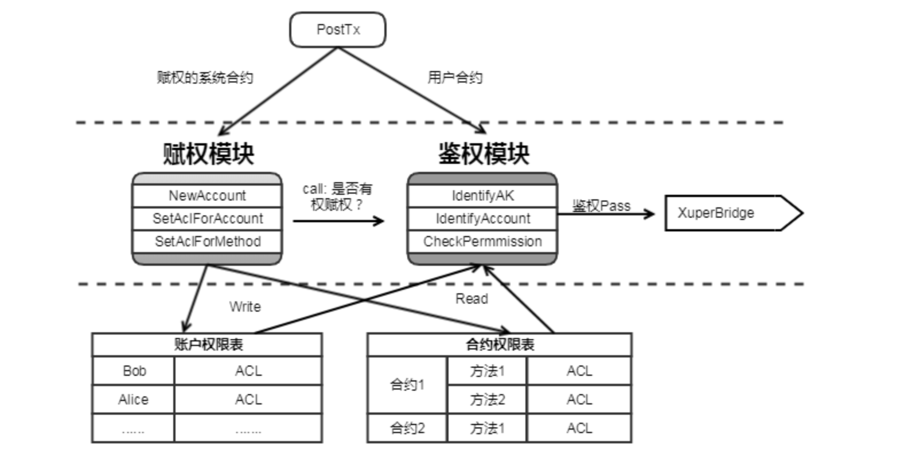

账号权限控制模型
================

背景
----

 XuperChain 需要一套去中心化的，内置的权限系统 为了实现这个目标，我们借鉴了业界很多现有系统如Ethereum、EOS、Fabric 的优点，设计一个基于账号的合约权限系统

名词解释
--------

- ``AK(Access Key)``：具体的一个address，由密码学算法生成一组公私钥对，然后将公钥用指定编码方式压缩为一个地址。
- ``账号（Account)``: 在 XuperChain 上部署合约需要有账号， 账号可以绑定一组AK（公钥），并且AK可以有不同的权重。 账号的名字具有唯一性。
- ``合约 (Contract)``: 一段部署在区块链上的可执行字节码，合约的运行会更新区块链的状态。我们允许一个账号部署多个合约。合约的名字具有唯一性。

模型简介
--------

系统会首先识别用户，然后根据被操作对象的ACL的信息来决定用户能否对其进行哪些操作

.. figure:: ../images/acl-intro.png
    :alt: ACL简介
    :align: center
    
    ACL简介

- 个人账号AK：是指一个具体的地址Addr
    - 用户的创建是离线的行为，可以通过命令行工具或者API进行创建
- 合约账号： XuperChain 智能合约的管理单元。
    - 账号的创建：
        - 任何账号或者AK都可以调用系统级智能合约创建账号
        - 创建账号需要指定账号对应的拥有者的地址集，如果一个账号中只有一个地址, 那么这个Addr对账号完全控制；
        - 创建账号需要指定ACL控制策略，用于账号其他管理动作的权限控制；
        - 创建账号需要消耗账号资源；
    - 账号名命名规则；
        - 合约账号由三部分组成，分为前缀，中间部分，后缀。
        - 前缀为XC，后缀为@链名
        - 中间部分为16个数字组成。
        - 在创建合约账号的时候，只需要传入16位数字，在使用合约账号的时候，使用完整的账号。
    - 账号管理：依地址集合据创建时指定的地址集和权限策略，管理账号其他操作
        - 账号股东剔除和加入
        - 账号资产转账
        - 创建合约，创建智能合约需要消耗账号资源，先将utxo资源打到账号下，通过消耗账号的utxo资源创建合约，验证的逻辑需要走账号的ACL控制
        - 合约Method权限模型管理
    - 智能合约： XuperChain 中的一个具体的合约，属于某个账号
        - 账号所属人员允许在账号内部署合约
        - 账号所属人员可以定义合约管理的权限模型
        - 设置合约方法的权限模型，合约内有一个权限表，记录：{ contract.method，permission_model}
    - 合约命名规则：长度为4~16个字符(包括4和16)，首字母可选项为\[a-ZA-Z\_\]，末尾字符可选项为\[a-zA-Z0-9\_\]，中间部分的字符可选项为\[a-zA-Z\_.\]

实现功能
--------

主要有两个功能：账号权限管理、合约权限管理

1. 账号权限管理 账号的创建、添加和删除AK、设置AK权重、权限模型
2. 合约权限管理 设置合约调用权限，支持2种权限模型： 
    a. 背书阈值：在名单中的AK或Account签名且他们的权重值加起来超过一定阈值，就可以调用合约 
    b. AK集合: 定义多组AK集合，集合内的AK需要全部签名，集合间只要有一个集合有全部签名即可

系统设计
--------

    
    ACL架构

ACL数据结构说明
^^^^^^^^^^^^^^^

.. code-block:: protobuf
    :linenos:

    // --------   Account and Permission Section -------
    enum PermissionRule {
        NULL = 0;             // 无权限控制
        SIGN_THRESHOLD = 1;   // 签名阈值策略
        SIGN_AKSET = 2;       // AKSet签名策略
        SIGN_RATE = 3;        // 签名率策略
        SIGN_SUM = 4;         // 签名个数策略
        CA_SERVER = 5;        // CA服务器鉴权
        COMMUNITY_VOTE = 6;   // 社区治理
    }

    message PermissionModel {
        PermissionRule rule = 1;
        double acceptValue = 2;    // 取决于用哪种rule, 可以表示签名率，签名数或权重阈值
    }

    // AK集的表示方法
    message AkSet {
        repeated string aks = 1; //一堆公钥
    }

    message AkSets {
        map<string, AkSet> sets = 1;   // 公钥or账号名集
        string expression = 2;      // 表达式，一期不支持表达式，默认集合内是and，集合间是or
    }

    // Acl实际使用的结构
    message Acl {
        PermissionModel  pm = 1;             // 采用的权限模型
        map<string, double>  aksWeight = 2;  // 公钥or账号名  -> 权重
        AkSets akSets = 3;
    }

签名阈值策略：  ``Sum{Weight(AK_i) , if sign_ok(AK_i)}  >=  acceptValue``

系统合约接口
^^^^^^^^^^^^

+---------------------+---------------------+
| 合约接口	          | 用途                |
+=====================+=====================+
| NewAccountMethod    | 创建新的账号        |
+---------------------+---------------------+
| SetAccountACLMethod |	更新账号的ACL       |
+---------------------+---------------------+
| SetMethodACLMethod  | 更新合约Method的ACL |
+---------------------+---------------------+

样例
^^^^

acl模型如下：

.. code-block:: json
    :linenos:

    {
        "pm": {
            "rule": 1,

            "acceptValue": 1.0
        },
        "aksWeight": {
            "AK1": 1.0,
            "AK2": 1.0
        }
    }

- 其中rule=1表示签名阈值策略，rule=2表示AKSet签名策略
- 签名的ak对应的weight值加起来>acceptValue，则符合要求

