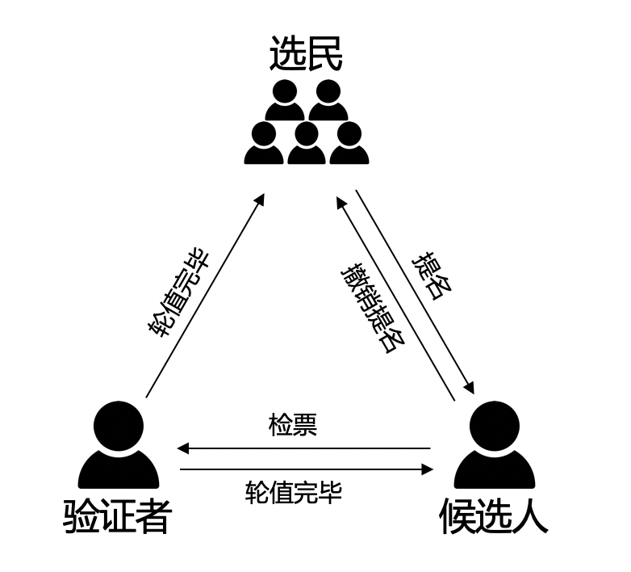

XPoS共识
=========

介绍
----

XPoS是 XuperChain 的一种改进型的DPoS算法，他是在一段预设的时间长度（一轮区块生产周期）内选择若干个验证节点，同时将这样一轮区块生产周期分为N个时间段， 这若干个候选节点按照约定的时间段协议协同挖矿的一种算法。在选定验证节点集合后，XPoS通过Chained-BFT算法来保证轮值期间的安全性。
总结一下，整个XPoS主要包括2大阶段：

1. 验证人选举：通过pos相关选举规则选出一个验证者集合；
2. 验证人轮值：验证者集合按照约定的协议规则进行区块生产；

候选人选举
^^^^^^^^^^

节点角色

在XPoS中，网络中的节点有三种角色，分别是“普通选民”、“候选人”、“验证者”：

1. 选民：所有节点拥有选民的角色，可以对候选节点进行投票；
2. 候选人：需要参与验证人竞选的节点通过注册机制成为候选人，通过注销机制退出验证人竞选；
3. 验证人：每轮第一个节点进行检票，检票最高的topK候选人集合成为该轮的验证人，被选举出的每一轮区块生产周期的验证者集合，负责该轮区块的生产和验证，某个时间片内，会有一个矿工进行区块打包，其余的节点会对该区块进行验证。

网络中的三种角色之间是可以相互转换的，转换规则如下：

1. 所有地址都具有选民的特性，可以对候选人进行投票；
2. 选民经过“候选人提名”提名接口成为候选人，参与竞选；
3. 候选人经过“候选人退选”注销接口退出竞选；
4. 候选人经过检票产出验证者，得票topK的候选人当选验证者；
5. 验证者轮值完恢复候选人或者选民角色；

提名规则

节点想要参与竞选，需要先被提名为候选人，只有被提名的地址才能接受投票。为了收敛候选人集合，并一定程度上增加候选人参与的门槛，提名为候选人会有很多规则，主要有以下几点：

1. 提名候选人需要冻结燃料，并且金额不小于系统总金额的十万分之一；
2. 该燃料会被一直冻结，直到节点退出竞选；
3. 提名支持自提和他提，即允许第三方节点对候选人进行提名；
4. 被提名者需要知晓自己被提名，需要对提名交易进行背书；

选举规则

候选人被提名后，会形成一个候选人池子，投票需要针对该池子内部的节点进行。XPoS的投票也有很多规则，主要有以下几点：

1. 任何地址都可以进行投票，投票需要冻结燃料，投票的票数取决于共识配置中每一票的金额，票数 = 冻结金额 / 投票单价；
2. 该燃料会被一直冻结，直到该投票被撤销；
3. 投票采用博尔达计分法，支持一票多投，每一票最多投给设置的验证者个数，每一票中投给不同候选人的票数相同；

候选人轮值
^^^^^^^^^^

每一轮开始的第一个区块会自动触发检票的交易，该交易会进行下一轮候选人的检票，被选举出的节点会按照既定的时间片协同出块，每一个区块都会请求所有验证节点的验证。XPoS的时间片切分如下图所示：

.. image:: ../images/tdpos-slice.png
    :align: center

为了降低切主时容易造成分叉，XPoS将出块间隔分成了3个，如上图所示：

- **t1**：同一轮内同一个矿工的出块间隔；
- **t2**：同一轮内切换矿工时的出块间隔，需要为t1的整数倍；
- **t3**：不同轮间切换时的出块间隔，需要为t1的整数倍；

拜占庭容错

XPoS验证节点轮值过程中，采取了 `Chained-Bft <chained_bft.html>`_ 防止矿工节点的作恶。

技术细节
^^^^^^^^

XPoS实现主要在 ``consensus/tdpos`` 路径下，其主要是通过智能合约的方式实现的，主要有以下几个合约方法：

.. code-block:: go
    :linenos:

    voteMethod = "vote"
    // 候选人投票撤销
    revokeVoteMethod = "revoke_vote"
    // 候选人提名
    nominateCandidateMethod = "nominate_candidate"
    // 候选人罢黜
    revokeCandidateMethod = "revoke_candidate"
    // 验证人生成
    checkvValidaterMethod = "check_validater"

核心接口如下：

.. code-block:: go
    :linenos:

    func (tp *TDpos) runVote(desc *contract.TxDesc, block *pb.InternalBlock) error {
        // ......
        return nil
    }
    func (tp *TDpos) runRevokeVote(desc *contract.TxDesc, block *pb.InternalBlock) error {
        // ......
        return nil
    }
    func (tp *TDpos) runNominateCandidate(desc *contract.TxDesc, block *pb.InternalBlock) error {
        // ......
        return nil
    }
    func (tp *TDpos) runRevokeCandidate(desc *contract.TxDesc, block *pb.InternalBlock) error {
        // ......
        return nil
    }
    func (tp *TDpos) runCheckValidater(desc *contract.TxDesc, block *pb.InternalBlock) error {
        // ......
        return nil
    }

