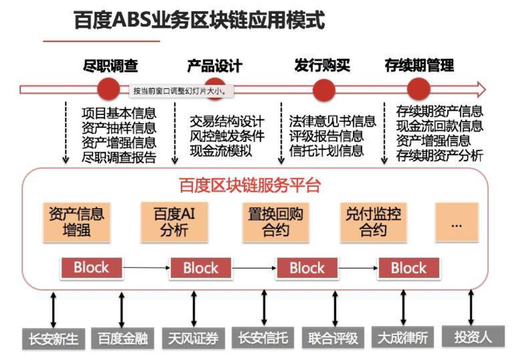

消费金融ABS融资系统
==============

ABS+区块链，引领ABS市场的创新趋势

案例概览
------------

基于百度自主研发、安全可控的区块链底层技术的，利用区块链去中心化、防篡改、可追溯等特性，依靠非对称加密算法划分权限，由各个参与机构分别上传其负责部分的信息，实现资产交易等全流程数据的实时上链，对现金流进行实时监控和精准预测，打造ABS平台上的“真资产”，有效解决资产质量真实性问题。

案例背景
------------

-  信用体系不健全，欺诈手段层出不穷，大数据风控中数据缺失、混乱等；
-  风险管理体系不完善，定价机制不完善，管理体制不精细化；
-  消费金融资产不够透明、标准化，交易各方对底层资产质量真实性出现信任问题；
-  由于信息不透明，融资方面临着企业融资成本高、融资周期长和主体信用溢价难的痛点；
-  资产变动过程不透明、资产信息披露少阻挡了投资者的热情；
-  监管机构则更看重非标资产信息披露，评级机构和其他参与方存在无法确认评级资产各环节信息的真实性的问题。

方案思路
------------

百度金融作为技术服务商搭建了区块链服务端BaaS（Blockchain as a Service）并引入了区块链技术，项目中的各参与机构（百度金融、资产生成方、信托、券商、评级、律所等）作为联盟链上的参与节点。

-  利用区块链“不可篡改”的特性打造了ABS平台上的“真资产”；
-  基础资产的变更、替换及各参与方的信息都具有不可篡改性，对投资者及各合作方有非常高的信息透明度；
-  投资者放心，加大降低企业的融资成本；
-  通过百度极限事务处理系统，可以支持百万TPS的交易规模，极大降低交易成本（比特币只有7TPS）；
-  通过百度千亿级流量清洗系统，抵御大规模的网络攻击；
-  通过百度安全实验室的协议攻击算法，确保协议、通信安全。

案例效果
------------

-  区块链技术实现了底层资产从Pre-ABS模式放款，到存续期还款、逾期以及交易等全流程数据的实时上链，对现金流进行实时监控和精准预测，提升了项目的效率、安全性和可追溯性，提高了对基础资产全生命周期的管理能力；
-  对于中介机构而言，区块链技术的介入，使得资产证券化产品尽调环节的尽调置信程度明显提升，尽调效率也得到提高；
-  对于投资者而言，所投资产的透明程度显著增强，同时二级交易的估值和定价也变得有据可依；
-  对于监管机构而言，能够更大程度上满足穿透式审核和监管的要求。

应用价值
------------

区块链技术的引入，使得ABS各参与主体对资产池的同时监控成为可能。在区块链上，记录每笔资产详情的账本对所有主体开放，使得计划管理人对资产的尽调的详实性提供了有力支持，评级机构可对每一笔资产的质量进行分析而非由于技术所限采用抽样调查手段，律所也能更大程度地把握整个资产池的法律风险。同时，资产服务机构能更便捷地掌握资产的还款和违约状况，投资者也能穿透底层资产增加信任度。
