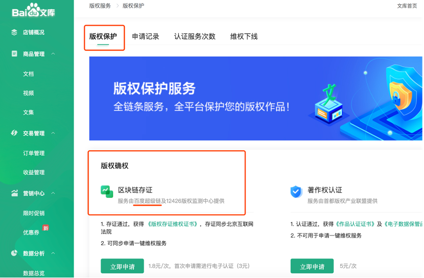

百度文库版权区块链服务
==============

打造原创保护新生态，建立良性、公平网络创作环境

案例概览
------------

百度超级链为百度文库打造的版权区块链服务，为原创作者和机构提供从版权保护、传播变现到监控维权的全链服务。

案例背景
------------

-  互联网具有通融互联、高速流动、资源共享、开放包容等特点，这些特征或者说优势是互联网得以飞速发展的最重要原因，每一位互联网的享用者都可以轻而易举地得到自己想要获取的信息，可以将这些信息为己所用，甚至可以不费吹灰之力使用这些信息资源从事盈利性的商业行为并赢取利益，如此一来，这些信息权利的拥有者想要保护自身的著作权，难度明显增大。
-  权利人维护自身著作权取证困难，维权成本过高。由于网络上获取相关信息资源方便，而且互联网后台技术非常成熟，对侵权内容进行修改、删除且不留痕迹，早已经不存在任何的技术障碍，这就在侵权案件的取证方面，造成了很大的困难。

方案思路
------------

百度超级链与人工智能、大数据技术进行融合，支持图片、文字、视频存证，提供版权局存证登记、存证信息实时上传区块链、生成版权存证维权证书等服务。在百度超级链技术的支持下，百度文库的创作者可以将各类原创作品实时上传、随时存证；同时，百度超级链与北京互联网法院、广州互联网法院、青岛仲裁委等司法机构跨链对接，确定数据未经篡改，判定对应的侵权事实，可以完成完整电子证据闭环，进一步解决了内容相关产业版权保护取证难的痛点。

案例效果
------------

-  百度文库上线针对内容创作者全新打造的知识营销产品——“知识店铺”，实现私域空间从内容展示到内容主动营销的升级，同时进一步拓宽视频、音频、课程体系等知识内容服务品类，持续加大对知识内容的版权保护力度。
-  百度文库针对版权保护独家开发“反盗版DNA系统”，日均处理文档超百万，查重精度达到99.99%，多维度保护平台原创版权内容。在此基础上，百度文库在文档版权行业创新引入区块链技术，为百度文库的“知识店铺”内容创作者提供区块链存证服务、著作权认证服务和全网实时监测等服务，从而实现了从创作源头到售卖、维权的版权服务链，保护内容创作者权益。数据显示，截止到2020年10月底，百度文库在2020年度已打击盗版累计达到1.3亿篇。

应用价值
------------

百度文库版权保护的强化，进一步完善了百度移动生态的知识产权保护体系，助力内容创作者持续产出优质内容，建立良性、公平的网络创作环境。百度文库版权区块链服务的上线，将使百度文库内容生态建设的版权保护体系更加完善，助力平台原创内容创作者成长。随着百度文库版权区块链的应用逐步普及，百度文库“知识店铺”的创作者们可以更加专注于多元化的优质内容创作和用户运营，解决版权侵权困扰，更好的提升内容变现和品牌形象。
