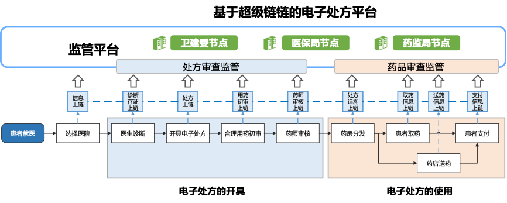
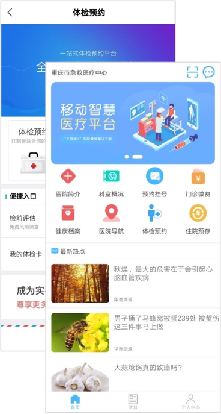

重庆市渝中区电子处方流转平台
==============

推动医疗数据上链，全方位监管诊疗过程，解决信息孤岛问题，提升就医体验

案例概览
------------

电子处方流转平台基于百度已经开源的XuperChain搭建，致力于解决传统医疗服务中数据共享、流通、归集和安全问题，有效支撑了电子处方等数据的上链流转以及医保支付流程打通，帮助实现政府对诊疗过程事前提醒、事中监控、事后追溯的全方位监管，同时让老百姓更加便捷、安全地买到所需要的药品，大提升就医体验。

案例背景
------------

- 乏先进的电子健康记录体系，就诊困难：患者个人信息泄露、病历数据泄露、病历数据错乱、跨区跨院转诊困难和数据临床业务脱节等现象成为了医疗领域的主要痛点,看病难、就医流程长也是面临的重要难题，尤其是一些慢特病患者，长期重复需要拿同一种药，每隔一段时间要重复就医，给线下医疗服务造成一定的压力；
- 医疗机构相互孤立：由于数据化程度低，各医院之间存在着明显的信息不对称现象。由于医院间相互孤立，病人信息无法同步，由此带来了巨大的人力物力的浪费，降低了行业的效率，阻碍行业快速发展；
- 数据标准不一，共享难度较大，数据孤岛现象普遍存在：从技术角度来讲，不同医院之间信息系统来自不同的供应商，系统接口的差异造成数据共享有一定难度；从医疗主体角度来说，部分医院出于吸引患者流量的需要和保护病人隐私的诉求，在数据共享方面持保守态度；从数据内容角度来看，医生对疾病的定义和描述有所差别，数据结构存在差异化。数据流通不畅及信息不对称产生了如就医体验差、医患矛盾、假药劣药等诸多问题；
- 数据泄露问题：互联网技术的快速发展为医疗健康发展带来机遇的同时，也产生网络安全隐患。互联网时代数据边界逐渐模糊、开放，数据易被攻击，但行业数据安全保护手段还有待提升。数据确权和规范问题是数据在产业生态体系中流通的主要障碍，建立合理的数据信任机制是构建数据要素市场化体系的前提；
- 纸质处方合规性难以保障，冒用、过期等问题长期存在：已有的电子处方平台为患者看病就医简化了流程，而区块链技术则保证了电子处方流转过程的安全及可追溯。

方案思路
------------

区块链具有不可篡改的优势，将医疗数据记录在区块链上，可以将数据加密，同时也无法篡改，成为医疗行业保护数据的有效方法，同时利用区块链溯源优势，避免假药泛滥。由于链上信息的公开透明，很大程度上解决了众多医院患者信息不互通的困境，打破信息孤岛，实现医院间信息的互联互通。

开具电子处方、取药送药、支付结算等信息的上链存证，保障“互联网+医疗”服务的数据安全、诊疗安全和用药安全。重庆市电子处方流转平台的底层网络基于百度自主研发的超级链技术搭建，由多个网络节点构成，除了医院，药店等节点之外， 医保局、卫计委、药监局作为监督管理角色加入，并与医院HIS系统、药店ERP系统进行了实时对接，确保把线下实体医院、互联网医院的每一条诊疗行为都完整地记录并实时上链。

案例效果
------------

- 基于百度电子处方区块链流转平台，医生诊断记录、处方、用药初审、取药信息、送药信息、支付信息都将“盖戳”后记录在电子处方流转链上。在平台上，医生可以远程为患者开具电子处方，患者在本地药房购买处方药，实现医药分离；
- 费者在购买药品的时候，通过个人数据上传将购买过程透明化，药监局、卫健委、医保局对全过程进行监管，满足监管需求，避免处方被滥用；
- 随着取药流程的推进，处方分发、患者拿药、结算等信息也会上链，实现从就诊、处方开具、审方、配送、患者用药等全流程医疗行为追踪。能够解决传统医疗服务中数据共享、流通、归集和安全问题。

应用价值
------------

百度超级链推动电子处方上链，促进了电子处方可信、安全、高效流转，从根本上杜绝了冒用和篡改等情况的发生，并推进新医改医药分离政策落实。截至目前，电子处方流转平台已经接入12家医院，其中包括1家三甲医院和11家社区医院。实现民众足不出门、在线取药。

关联单位介绍
------------

华医康道，医疗健康服务产业价值互联网平台，秉承“用科技让医疗服务触手可得”的品牌使命，致力于构建覆盖“医院-社区-家庭”全场景的医疗健康服务生态。荣获”2020年中国区块链技术创新典型企业称号”，助力多家医院获评”智慧医院”， 享受党中央、国务院对互联网+医疗健康发展的多方面政策支持。
    