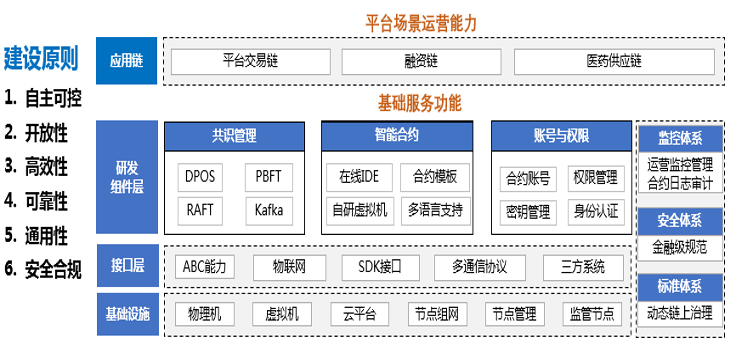

云南省生物医药可信供应链金融平台
==============

聚焦医药行业，打通供应链“筋络”， 推动区块链和实体经济深度融合

案例概览
------------

云南省生物医药可信供应链金融平台是基于百度自主研发、安全可控的区块链底层技术，结合供应链真实贸易场景构建。利用区块链去中心化、防篡改、可追溯等特性，充分发挥区块链在促进数据共享、优化业务流程、降低运营成本、提升协同效率、建设可信体系等方面的作用，将有效解决供应链金融长期存在的信息造假风险、数据不共享流通、核心企业信用传递难、中小企业融资难、银行风控难等业务难题，进一步推动区块链和实体经济深度融合。

案例背景
------------

- 统的医药产业供应链中，企业生产过程和流通过程缺少透明度，缺少有关医药产品的价值信息和相关的生产信息、数据， 导致药品安全性问题出现，商业银行贷款缺少这些信息而给这些企业贷款，最终导致不安全、假冒药品流通于市场，而又无法追本溯源；
- 三四级中小型供应商和经销商融资成本高，银行处于风控角度考虑，不愿贷款，中小生物医药企业融资困难。
【方案思路】
以新昆华医院为核心企业整合供应链上下游企业;以富滇银行为金融合作方，提供融资与结算支持;以省医药公司为供应商主体，采用区块链技术提供去中心化、防篡改、可追溯的贸易背景实现“融信”的流通、拆分、兑付、融资。在区块链上运行有关数字票据，可以在公开透明、多方见证的情况下进行随意的拆分和转移。

案例效果
------------

- 基于链上数据可追溯且难以篡改的特性，使得生物医药溯源成为可能，用户可以对生物医药的全生命周期数据进行可信溯源查询；
- 有效减少供应链上下游的资金周转时间，缓解中小型药商的融资困难。通过区块链技术，医药流通行业的大量中小医药商业企业的交易数据和信用数据都会更透明化和可信，有助于金融机构能更好更快的评估企业信用，可以实现金融机构为重要医药商业企业以及第三方医药物流企业，提供快速无抵押的信用融资，从而能极大的缓解医药流通行业的资金紧张局面；
- 基于可信数字身份和可信数字签名技术，能够对供应链中各企业间的合同和票据进行存证，并在进一步对接公证处、司法鉴定中心、互联网法院后，拥有较强的司法效力；
- 通过将一些业务逻辑编写为智能合约并安装到区块链网络后，能够减少人为干预，提升公信力，并进一步增强供应链中各参与方对业务数据真实性的认可；
- 基于区块链无需对账的特性，各个参与方可以降低数据同步的开销，降本增效。

应用价值
------------

以区块链技术为生物医药产业打造可信的供应链服务生态，解决供应商融资难问题，缩短生物医药供应帐期，保障生物医药产业持续健康发展，推动云南省区块链技术快速应用与区块链产业发展，实现上下游产业链新增产值、企业新增销售收入、企业新增研发投入。金融科技的火热发展，互联网技术、物联网技术以及区块链技术的进一步引入，为供应链金融的发展提供强大技术支撑，让生物医药供应链金融的资金流、物流、信息流等信息变得更加透明。
