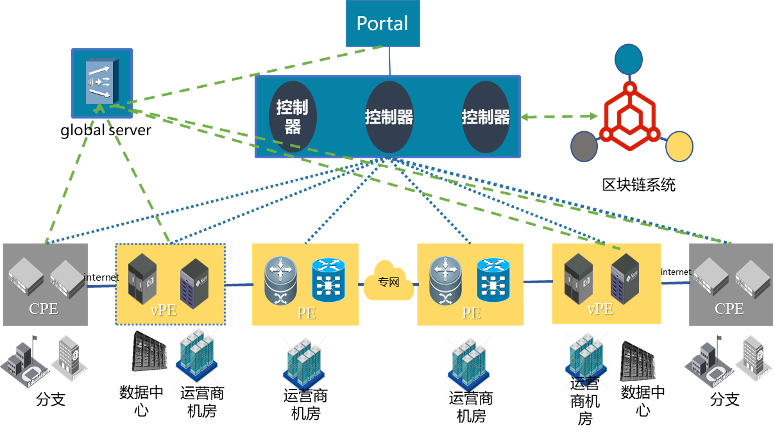

SD-WAN跨运营商网络资源共享平台
==============

透明可信的网络资源调度、结算服务，降低信任成本
合作单位：紫金山实验室

案例概览
------------

在利用SD-WAN技术为租户提供跨运营商网络服务的场景中，引入区块链技术，实现SD-WAN控制器拥有方可自证清白地实现依据租户需求提供透明、高效的跨运营商网络切换的目标；实现去中介化的网络资源供需双方流量结算的目标。

案例背景
------------

在利用SD-WAN技术为租户提供跨运营商网络服务的场景中，SD-WAN控制器拥有方难免从自身利益出发而不是从为租户提供最优网络服务的角度为租户切换运营商网络专线，由于切换过程不透明，租户即使感知到网络质量不符合要求也很难维护自己的权益。此外流量结算仍有单一的SD-WAN控制器拥有方出具，且不支持账单追溯，以上调度、结算不透明的问题限制了SD-WAN的发展。

方案思路
------------

对应用场景进行分析，梳理重构业务流程，提取多方参与的环节并分析对可信的需求，基于区块链技术给出解决方案并评估方案的可行性，最后进行原型系统开发、测试验证。

应用价值
------------

SD-WAN的网络控制器不再由运营商唯一提供，而是由多方共同提供，控制器可以基于全局视角从众多运营商中为用户调度高效率低成本的网络服务，解决单一运营商锁定的问题，使得众多运营商可以公平的参与进来。区块链可以在不同节点之间建立信任，具有对等自治、数据共同维护防篡改的特性，在SD-WAN解决方案中建立可信的调度机制与互信的交易模式。
 
关联单位介绍
------------

网络通信与安全紫金山实验室成立于2018年，是江苏省和南京市为了打造具有全球影响力的创新名城，共同推进建设的重大科技创新平台。紫金山实验室面向网络通信与安全领域国家重大战略需求，以引领全球信息科技发展方向、解决行业重大科技问题为使命，通过聚集全球高端人才，开展前瞻性、基础性研究，力图突破关键核心技术，开展重大示范应用，促进成果在国家经济建设中落地。紫金山实验室力图打造航母级国家研究平台，形成对国家战略和安全需求的能力支撑。
    