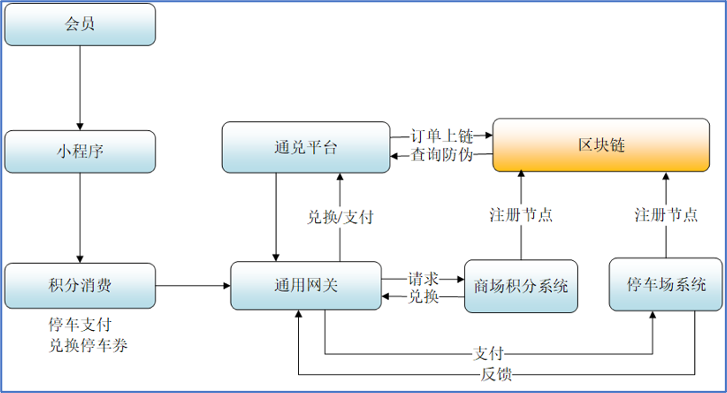
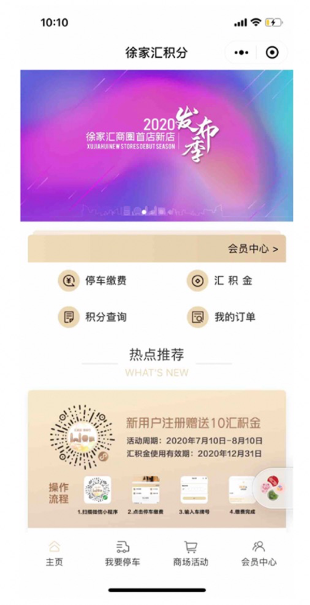

上海市徐家汇商圈积分平台
==============

搭建完整商圈积分平台，”区块链+积分”，赋能徐家汇商圈智慧化升级

案例概览
------------

上海市徐家汇商圈积分平台采用”区块链+积分”的新范式，依托百度自主研发区块链技术，建立徐汇区块链，以各商场积分系统、停车场系统为节点，将会员在通兑平台中发生的所有交易订单数据都上链，形成多渠道、多终端、多商品品种的数字资产链上管理系统，让消费者与商家互利互信，加快商品流通效率，增加积分商城兑换物品丰富度，同时实现跨商场积分通兑停车支付。

案例背景
------------

- 闲置积分问题：徐家汇商圈内各商场经营20余年来，积累了大量的会员数据，且各商场间的数据存在部分重合，但各商家独立会员关系体系对应的积分兑换策略多为到店兑换实物或代金券两种形式，并且积分兑换率很低，存在大量闲置积分。大量僵尸会员及睡眠积分的存在为企业的后续营销提高门槛。
- 积分通兑门槛较高：相较成熟电商平台如天猫、京东来看徐家汇商圈百货的用户积分，单个百货商店积分体系体量很小，可通兑的物品种类很少，而通兑门槛又很高，对百货商店用户而言，通兑门槛很高，用户选择范围受限制，从而导致无法通过积分营销，激活睡眠积分促进用户活跃度，反而催生僵尸用户的产生。
- 智慧停车相对落后：在市经信委、市商务委联合开展的2016年上海市智慧商圈发展水平评估过程中，因太平洋百货无停车场，智慧停车部分被扣分，徐家汇商圈落后五角场商圈，屈居第二。据统计，整个徐家汇地区营业性停车场所共计61家（含商场、医院、商务楼、学校、社区、酒店等），停车位8931个。其中，集团有投资关系的停车场所只有4家，分别为汇金（徐汇店）、美罗城、港汇、T20，停车位一共不足八百个。上述企业仅汇金（徐汇店）一家实现停车后的统一电子化支付，从智能化和环保角度而言，徐家汇商圈已明显落后于其他新建的商业中心。另外，各商场之间停车数量存在较大差异，导致停车困难，车位不能够充足合理的利用。

方案思路
------------

本系统将基于业界领先的微服务技术架构进行实现，包括基础运行环境层、数据层、组件层、业务层和应用层。各商场积分系统、停车场系统作为节点，在徐汇链中注册，然后将会员在通兑平台中发生的所有交易订单数据都上链，保证数据的可信性。

案例效果
------------

- 积分通兑平台：帮助那些自己没有建立起会员积分体系的商家，为他们提供一套完整的会员与积分系统，同时也考虑到那一部分有自己系统的商家，允许商家以接口对接的方式接入并推送积分的相关数据。
    
- 服务提供商平台：提供了一套完整的积分收款、订单管理及财务对账系统。通过扫码收款的正扫、反扫功能，满足各种场景下的收款收费需求。订单管理、对账管理方便了商家订单的查询记录、对账结算。通过信息管理功能，商家可以维护自己的基本信息、详情介绍、签约服务周期等。展示管理是在客户端一节中提到的“商家展示”功能的维护后台。
    
1. 通过百度区块链平台建设的“徐家汇积分”小程序，打通了徐家汇多家商家的积分系统，并将积分兑换、消费、结算上链，实现多个商场的积分打通；
2. 建立联合会员体系，激活僵尸用户；形成多渠道、多终端、多商品品种的数字资产链上管理系统，进而解决商品流通环节的信息互通难题，让消费者与商家能互利互信，加快商品流通效率；
3. 增加积分商城兑换物品丰富度的同时，实现跨商场积分通兑停车支付；
4. 区块链的HASH加密和防篡改功能，为积分信息及用户信息安全提供了保障。
    
.. image:: ../../images/token2.png
    :align: center

应用价值
------------

“徐家汇商圈积分”平台的上线，不仅增强了各商家之间积分相互认证和相互使用，也优化了商圈用户的体验。同时“区块链＋积分”的新范式也将为传统商业模式带来巨大变化，引发新一轮产业格局升级，让商家用全方位数字体验实现精准营销，从而引领业务增长。
