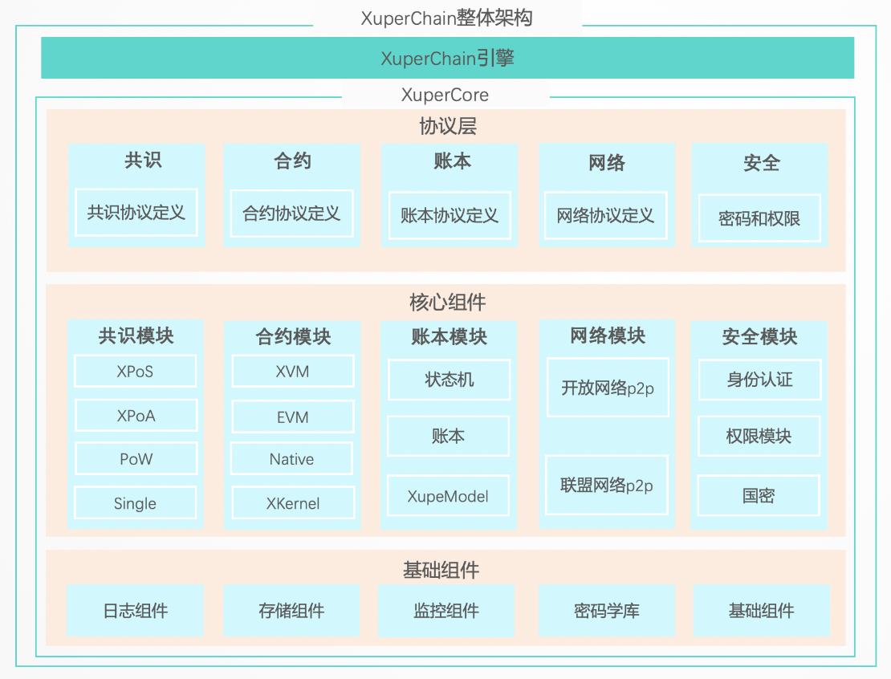
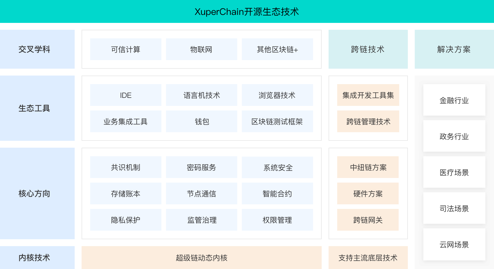

.. _brief:

整体介绍
==================

简介
--------------

XuperChain是百度100%自主研发，拥有完全自主知识产权的区块链底层技术。拥有500+篇核心技术专利。XuperChain以 **高性能、自主可控、开源** 为主要设计目标，响应国家政策，打破了国外技术在区块链技术领域的垄断，致力于创建 **最快、 最通用、 最好用** 的区块链底层技术。2019年5月，XuperChain正式向全社会开源。2020年9月，百度将XuperChain的内核技术XuperCore捐赠给开放原子开源基金会，以全新的开源治理模式面向全社会。

核心优势
---------

超高性能
>>>>>>>>>
XuperChain致力于打造最快的区块链底层技术。性能一直是区块链技术被广泛应用的最大障碍。XuperChain基于独创的XuperModel技术、大规模节点快速共识技术、AOT加速的WASM虚拟机技术等核心技术，保证了XuperChain的超高性能。并高分通过全行业的功能、性能测评，单链性能达8.7WTPS。

高可扩展
>>>>>>>>>
XuperChain致力于打造最通用的区块链底层技术。不同的应用场景对于区块链的使用需求不同，为了适应更多的场景，底层技术需要能够可扩展。XuperChain基于动态内核技术，实现无内核代码侵入的自由扩展内核核心组件和轻量级的扩展订制内核引擎，满足面向不同场景的区块链实现的需求。并且不同的模块有丰富的技术选型。

高度易用
>>>>>>>>>
XuperChain致力于打造最好用的区块链底层技术。XuperChain具有丰富的生态工具、官方文档教程、7*24小时开源社区支持，大大降低开发者的使用门槛。能够帮助用户快速上手，构建自己的区块链应用。

自主研发
>>>>>>>>>
XuperChain是百度100%自主研发的技术，核心技术完全自主可控，并采用Apache2.0协议向全社会免费开源。

架构设计
---------

XuperChain的系统架构设计，采用模块化架构，基础组件模块化共用，内核层聚合各组件，提供能力实现业务需求，从而实现核心流程低成本订制。通过对业务抽象分层、划分子领域和模块化，最大限度的提升代码复用和系统可扩展性。从而做到，通过低成本的定制不同流程来满足不同场景的需求，最大限度的复用核心基础能力。通过分治降低系统复杂度，提升系统可维护性。

整个系统分成三层，其中下面三层构成整个XuperChain内核的核心组成部分，分别为应用服务层、领域服务层、基础库层。

核心服务层
>>>>>>>>>>>
这一层定义区块链的各个模块API、核心结构和流程，并管理各模块的加载和初始化，聚合和调度各核心组件实现系统需求。

领域服务层
>>>>>>>>>>>
这一层负责区块链核心组件的具体实现，通过实现核心层定义的、接口和加载方式，接入到系统。这层的组件可以针对不同的需求场景有多种不同的实现。

基础组件层
>>>>>>>>>>>
这一层实现业务无关的通用基础库，各层都可以引用。

生态技术
---------

围绕者XuperChain底层核心技术，构建起了整个开源生态技术体系，形成强大的开源技术生态。整个技术生态主要包括内核技术、核心方向、生态工具、交叉学科、解决方案五大组成部分。

内核技术
>>>>>>>>>
内核层就是XuperChain内核技术，其定义了一系列标准API，构建一个区块链体系结构，规定了各个模块的逻辑结构、功能特征和各模块间的交互关系，并提供了各个模块适用不同场景的标准实现。

核心方向
>>>>>>>>>
核心技术方向是基于内核标准API定义的区块链体系结构之上，各个组成可以独立发展起来的技术方向，主要包括九大核心技术方向，分别包括共识技术、密码服务、存储账本、节点通信、智能合约、系统安全、监管治理、隐私保护、跨链技术等。

生态工具
>>>>>>>>>
生态工具技术是围绕着分布式账本技术的周边技术，主要包括区块链管理工具技术、区块链测试技术、钱包技术、浏览器技术、业务集成工具集、合约开发工具集(IDE、XDEV)等等。

交叉学科
>>>>>>>>>

主要是XuperChain技术和其他技术相结合的交叉学科技术，比如去中心化身份技术、可信计算技术、边缘技术以及5G技术等等。

解决方案
>>>>>>>>>
行业领域技术主要是区块链应用具体行业所产生的行业领域技术，比如与金融行业、供应链领域、医疗行业、政务行业等，目前XuperChain已经在30+场景，100+应用落地。

