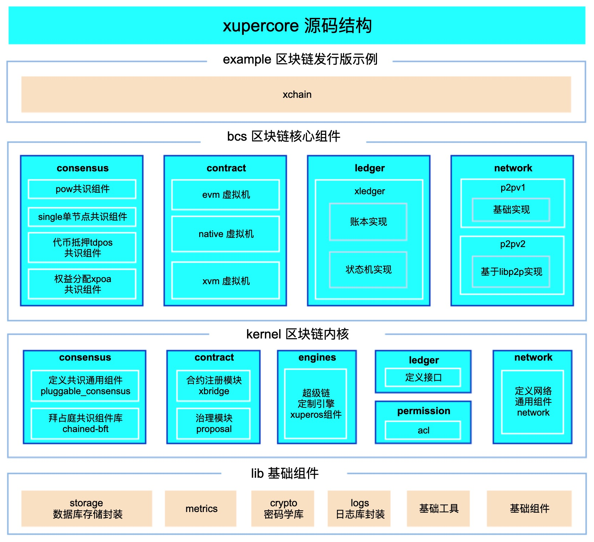

源码解读
========

xupercore
-------
XuperCore作为区块链基础内核框架，目前主要支撑了区块链标准发行版XuperOS(超级链开放网络)和XuperChain(超级链开源方案)。

XuperCore基于动态内核技术，实现无内核代码侵入的自由扩展内核核心组件和轻量级的扩展订制内核引擎，满足面向各类场景的区块链实现的需要；目前提供了全面的、高性能的内核组件实现。

目录结构
>>>>>>

XuperCore源码主要由lib、kernel、bcs、example四层组成，在代码结构中分别由四个同名文件夹表示，整体结构示意和目录结构如下。
在架构上，bcs各核心组件的编码同时也是kernel层对应各组件的接口实现。kernel层中的engines模块拼装了各组件，并定义了数据在本区块链引擎中的流转顺序。开发者也可根据自己对业务系统不同的处理方式，定义属于自己的引擎。

    XuperCore源码结构示意图

+-----------+--------------------------------------------------------------------------+
| 目录名    | 功能                                                                     |
+===========+==========================================================================+
| bcs/      | blockchain core service，领域服务层，主要包含了可被装载的各具体领域组件。|
+-----------+--------------------------------------------------------------------------+
| example/  | 区块链发行版示例，使用各组件实现了一个区块链服务系统。                   |
+-----------+--------------------------------------------------------------------------+
| kernel/   | 内核层，共识、账本、智能合约、网络等主要模块的接口规范及可复用库定义。   |
+-----------+--------------------------------------------------------------------------+
| lib/      | 基础库组件，包括日志、数据库、上下文等封装。                             |
+-----------+--------------------------------------------------------------------------+
| protos/   | 各组件使用到的pb文件。                                                   |
+-----------+--------------------------------------------------------------------------+
| tools/    | 部署脚本示例。                                                           |
+-----------+--------------------------------------------------------------------------+

kernel（内核层）开发套件
>>>>>>
kernel开发套件主要包括执行引擎示例xuperos以及共识、网络、账本、智能合约等核心组件的通用定义规范。
XuperCore的动态内核架构使得用户可通过根据需要灵活组合各核心组件，从而定制属于自己的引擎示例。

**核心设计要点**
    **a. 多引擎架构**
    
	engines模块支持多引擎架构，以示例xuperos为例，其通过组合现有内核核心组件，提供了一个具备两层共识及多合约虚拟机的区块链定义。多引擎架构让内核具备可多纬度、轻量级、无代码侵入订制扩展能力。

    **b. 区块链领域组件编程规范**

	consensus、ledger、contract、network、permission中定义了区块链各核心组件的对外接口，各核心组件的上层实现组件都必须按照接口规范进行编码，该规范设计让内核各核心组件可以无代码侵入自由替换扩展。

    **c. 可注册系统合约**

	XuperCore提供了系统合约虚拟机（XKernel）供系统内部使用，支持系统本身扭转的对应合约方法被称为系统合约（KernMethod），各模块可通过系统合约注入，使用Xmodel将自身数据存储在链上，避免链外数据带来的安全性和稳定性干扰。

**引擎可定制化**
    **a. 区块链引擎**
	区块链引擎是XuperCore的一个重要概念，其表示了驱动区块链系统运转的一系列定制逻辑，也可以被看作为对系统中的特定一条区块链结构的定义，这条特定的区块链由共识、网络、账本和智能合约等核心模块组成，且有清晰的调用逻辑关系。

    **b. xuperos**
	XuperCore的具体引擎放置在kernel下的engines，代码中给定了一款官方定制示例xuperos。具体如下表。

	+--------------+---------------------------------------------------------------------------------+
	| 模块名       | 功能                                                                            |
	+==============+=================================================================================+
	| common/      | 定义上下文。定义链接口规范，xuperos中的链提交流程特定为“预执行-执行”。          |
	+--------------+---------------------------------------------------------------------------------+
	| config/      | 定义本引擎配置，包括主链名称和区块广播模式等配置。                              |
	+--------------+---------------------------------------------------------------------------------+	
	| reader/      | 链对外暴露的读能力集合。同时定义了共识、智能合约、账本和utxo的读接口。          |
	+--------------+---------------------------------------------------------------------------------+
	| chainmgmt.go | chainmgmt定义了一个管理者结构和行为，其支持多条链的同时管理。                   |
        +--------------+---------------------------------------------------------------------------------+
	| net/         | 本引擎绑定的区块链节点消息处理模块，负责处理定义的多种p2p网络消息。             |
	+--------------+---------------------------------------------------------------------------------+
	| miner/       | 本引擎定义的矿工结构，负责生产区块和同步区块，定义组织区块的逻辑。              |
	+--------------+---------------------------------------------------------------------------------+
	| chain.go     | 定义本引擎中一条通用链的具体数据结构和行为。                                    |
	+--------------+---------------------------------------------------------------------------------+
	| engine.go    | 定义xuperos执行引擎，可看作区块链节点的启动和销毁入口。                         |
        +--------------+---------------------------------------------------------------------------------+
	| event/       | 本引擎定义的一种事件通知系统，目前支持区块粒度的相关交易通知订阅功能。          |
	+--------------+---------------------------------------------------------------------------------+
	| asyncworker/ | 本引擎定义的交易异步事件机制，使用事件通知，使得注册的相关交易会在被上链时执行。|
	+--------------+---------------------------------------------------------------------------------+
	| parachain/   | 本引擎定义的一种平行链机制，支持链的动态加载和卸载。                            |
	+--------------+---------------------------------------------------------------------------------+

bcs（blockchain core service）层
>>>>>
**核心组件**
    **a. consensus共识**
	**组件规范**
		bcs层定义的共识组件均遵循kernel层的热插拔共识（pluggable_consensus）流程，统一由kernel层热插拔共识进行组装、吊起和销毁，并严格实现了热插拔共识对外定义的接口。

	**开发须知**
		目前本层共识实现使用了特定标准进行开发，将共识分为status（共识实时状态）、schedule（候选人节点选举逻辑）、kernel_contract（系统合约）。		

		status实现了热插拔共识的ConsensusStatus接口，实时状态目前被存储在内存中，向外提供当前矿工等共识相关信息的读取能力。

		schedule定义了共识模块内部选举候选人（即矿工）的逻辑。

		kernel_contract是共识模块自定义的一些系统合约，用于将共识相关信息在链上存储，避免了链外数据的使用，用户可以根据需求定制自己的相关系统合约。

    **b. xledger账本**
	**账本**
		首先需注意的是，区块链执行引擎和账本组件是强绑定关系，不同区块链执行引擎可以选择绑定不同的账本组件，但通常只有唯一映射的关系。考虑到框架整体的可扩展性，kernel层ledger中只对数据结构做了基本要求，仅抽象定义合约和共识依赖接口规范，不做账本其他结构和接口约束，由具体账本实现自由定义，因此，在bcs层自定义账本需考虑到账本在区块链系统中的所有细节。本框架提供了xledger实现，虑到交易池、状态机、账本之间的强相关关系，xledger把交易池、状态机、账本统一归到账本组件提供。

	**状态机**
		状态机（state）一方面可以看作账本的状态映射，一方面也存储着待打包的未确认交易。xledger中的状态机主要定义了以下结构。

		+---------------------------+-----------------------------------------------------------+
		| 模块名                    | 功能                                                      |
		+===========================+===========================================================+
		| meta/                     | 元信息表，存储当前最新区块状态。                          |
		+---------------------------+-----------------------------------------------------------+
		| utxo/                     | 定义原生代币utxo及utxo表。                                |
		+---------------------------+-----------------------------------------------------------+
		| xmodel/                   | 定义xmodel模型、xmodel数据表和历史版本表。                |
		+---------------------------+-----------------------------------------------------------+
		| block.go                  | 定义区块数据结构和行为。                                  |
		+---------------------------+-----------------------------------------------------------+
		| block_height_notifier.go  | 支持event事件订阅功能，当最新区块更新时通知监听者。       |
		+---------------------------+-----------------------------------------------------------+
		| reserved_contract.go      | 支持背书检查。                                            |
		+---------------------------+-----------------------------------------------------------+
		| state.go                  | 状态机对外暴露功能，包括验证交易VerifyTx、执行交易DoTx等。|
		+---------------------------+-----------------------------------------------------------+
		| tx_verification.go        | 状态机具体验证交易方法集合。                              |
		+---------------------------+-----------------------------------------------------------+

	**未确认交易**
		xledger的未确认交易表被定义在tx文件夹下。

    **c. network网络**
	**组件规范**
		bcs层定义的网络组件p2pv1和p2pv2均遵循kernel层的Network接口规范，提供了以下接口的实现。

		+-----------------------------------------------------------+-------------------------------------------------------+
		| 接口                                                      | 功能                                                  |
		+===========================================================+=======================================================+
		| SendMessage(xctx.XContext, *pb.XuperMessage,              | 发送消息，异步模式。                                  |
		| ...p2p.OptionFunc) error                                  |                                                       |
		+-----------------------------------------------------------+-------------------------------------------------------+
		| SendMessageWithResponse(xctx.XContext, *pb.XuperMessage,  | 发送消息，同步模式，节点会收集对等节点的响应。        |
		| ...p2p.OptionFunc) ([]*pb.XuperMessage, error)            |                                                       |
		+-----------------------------------------------------------+-------------------------------------------------------+
		| NewSubscriber(pb.XuperMessage_MessageType,                | 订阅者实现，用于区分不同消息类型和处理方法。          |
		| ...p2p.OptionFunc) ([]*pb.XuperMessage, error)            |                                                       |
		+-----------------------------------------------------------+-------------------------------------------------------+
		| Context() *nctx.NetCtx                                    | 网络组件必须使用kernel层定义的网络上下文。            |
		+-----------------------------------------------------------+-------------------------------------------------------+
		| PeerInfo() pb.PeerInfo                                    | 对等节点的邻居节点，节点信息必须符合kernel层定义的    |
		|                                                           | pb结构，节点账户Account使用string类型标识，为acl账户。|
		+-----------------------------------------------------------+-------------------------------------------------------+

**组件开发须知**
    **开发者在自定义组件时，需要严格遵守kernel层对各模块的接口规范**

