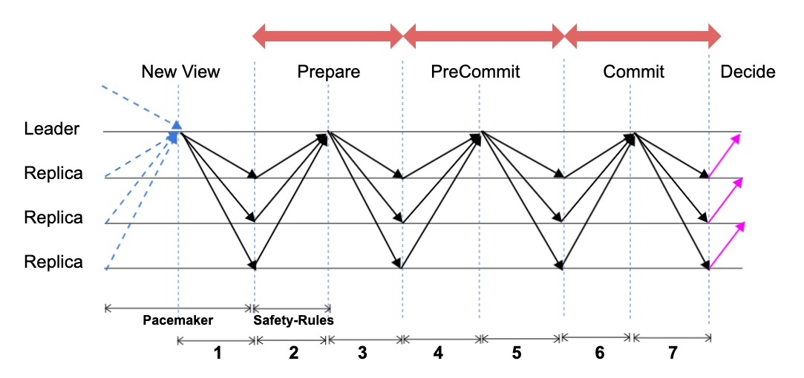
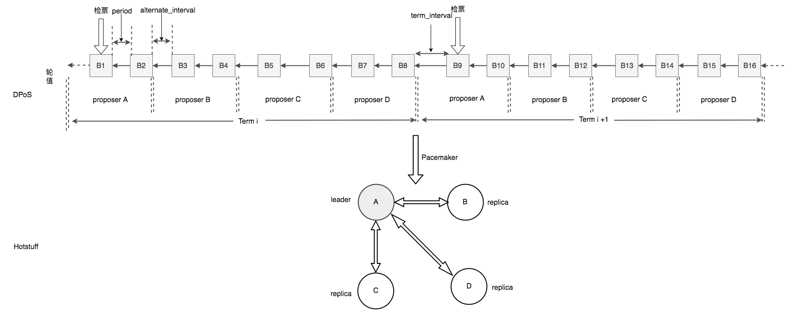

Chained-BFT共识公共组件
=======================

概述
----

在 ` XuperChain 共识框架 <consensus.html>`_ 一文中介绍了 XuperChain 底层有一个共识的公共组件叫chained-bft，其是Hotstuff算法的实现。HotStuff是一种简洁而优雅的bft改进算法。它具有以下优点：

- 它的设计中将liveness和safty解耦开来，使得非常方便与其他的共识进行扩展；
- 将bft过程拆解成3阶段，每个阶段都是o(n)的通信；
- 它允许一个节点处于不同的view，并且将view的切换与区块结合起来，使得其能够实现异步共识，进一步提升共识的效率。

这样一个chained-bft可以在给定主集合的场景下确保网络的共识安全性，并且通过与外层共识配合工作实现共识的活性保证。

**Xuperchain现有基于Chained-BFT的共识算法**

目前基于chained-BFT的算法有：XPoA、XPoS

**chained-BFT中区块需要在三个块后才被最终一致确认**

HotStuff中明确了基本算法Basic HotStuff和链式算法Chained-HotStuff的概念，其中Chained-HotStuff是Basic HotStuff的流水线链式结构，也是 XuperChain chained-BFT的算法原型。

和PBFT一样，Basic HotStuff也被分成了三个阶段: Prepare、Pre-Commit、Commit，如下图所示。

Chained-Hotstuff并发操作了原本的Basic HotStuff，将上一视图在所在阶段的信息发给下一视图的Leader，从而形成了流水线操作，增加效率。

正因为Basic HotStuff分为三个阶段，在完成三阶段的信息过程后，才最终形成一执行，即在当前视图在三个视图之后才最终完成了信息收集与执行。在chained-BFT中，视图与区块高度是一致绑定的，因此一个区块需要在三个区块后才被确认。

核心数据结构
------------

.. code-block:: go
    :linenos:

    enum QCState {
        NEW_VIEW = 0; 
        PREPARE = 1;
        PRE_COMMIT = 2;
        COMMIT = 3;
        DECIDE = 4;
    }
    // QuorumCert is a data type that combines a collection of signatures from replicas.
    message QuorumCert {
        // The id of block this QC certified.
        bytes BlockId = 1;
        // The current type of this QC certified.
        // the type contains `NEW_VIEW`, `PREPARE`,`PRE_COMMIT`, `COMMIT`, `DECIDE`.
        State Type = 2;
        // The view number of this QC certified.
        int64 ViewNumber = 3;
        // SignInfos is the signs of the leader gathered from replicas
        // of a specifically certType.
        QCSignInfos SignInfos  = 4;
    }
    // QCSignInfos is the signs of the leader gathered from replicas of a specifically certType.
    // A slice of signs is used at present.
    // TODO zq: It will be change to Threshold-Signatures 
    // after Crypto lib support Threshold-Signatures.
    message QCSignInfos {
        // QCSignInfos 
        map<string, SignInfo> QCSignInfos = 1;   
    }
    // SignInfo is the signature information of the 
    message SignInfo {
    string Address = 1;
    string PublicKey = 2;
    bytes  Sign = 3;
    }
    // ChainedBftMessage is the message of the protocal
    // In hotstuff, there are two kinds of messages, "NEW_VIEW_Message" and "QC_Message".
    // In XuperChain, there is only one kind of message, "NEW_VIEW. The "QC_Message" is resuded with "BroadcastBlock" message.
    message ChainedBftMessage {
        // Message Type
        QCState Type = 1;
        // Justify is the QC of the leader gathered, send to next leader.
        QuorumCert Justify = 2;
    }
    // ChainedBftMessage is the vote message of 
    message ChainedBftVoteMessage {
        // The id of block this message vote for.
        bytes BlockId = 1;
        // Replica will sign the QCMessage if the QuorumCert if valid.
        SignInfo signature = 2;
    }

整个chained-bft中主要包括三部分，分别是状态机 ``Smr`` 、 ``SafetyRules`` 和 ``PacemakerInterface`` 。

Smr
---

Smr是 ``chained-bft`` 的核心实例。他的主要的作用有以下几点：

1. 维护节点链的chained-bft共识状态机；
2. 在外层共识的驱动下发起 ``NewView`` 和 ``NewProposal`` 等消息并更新本地状态；
3. 处理其他验证节点的消息并更新本地状态；

.. image:: ../images/chained-bft.png
    :align: center

Safety Rule
-----------

Safety Rule 是一个验证节点是否要接受一个新的Proposal的安全性规则，主要有三条：

1. 判断当前Proposal的View值是否大于本地locked Proposal的View值；
2. 验证当前Proposal中上一个Proposal的投票信息有效性和投票个数是否大于系统矿工数目的2/3；
3. 验证当前Proposal的ProposalMsg是否有效；

当一个验证节点收到一个新的提案时，如果满足上述 ``Safety Rule`` 的认证，则会给这个提案进行投票，否则拒绝这次提案。

PacemakerInterface
------------------

Hotstuff算法的一大特点就是将共识的liveness和safety分开。PacemakerInterface是Hotstuff算法Pacemaker的接口定义，外层共识通过实现这些接口，可以推进内层共识的状态轮转。不同的外层共识可以有不同的实现。目前 XuperChain 已经实现了DPoS+Hotstuff，具体的方案如下所示：

