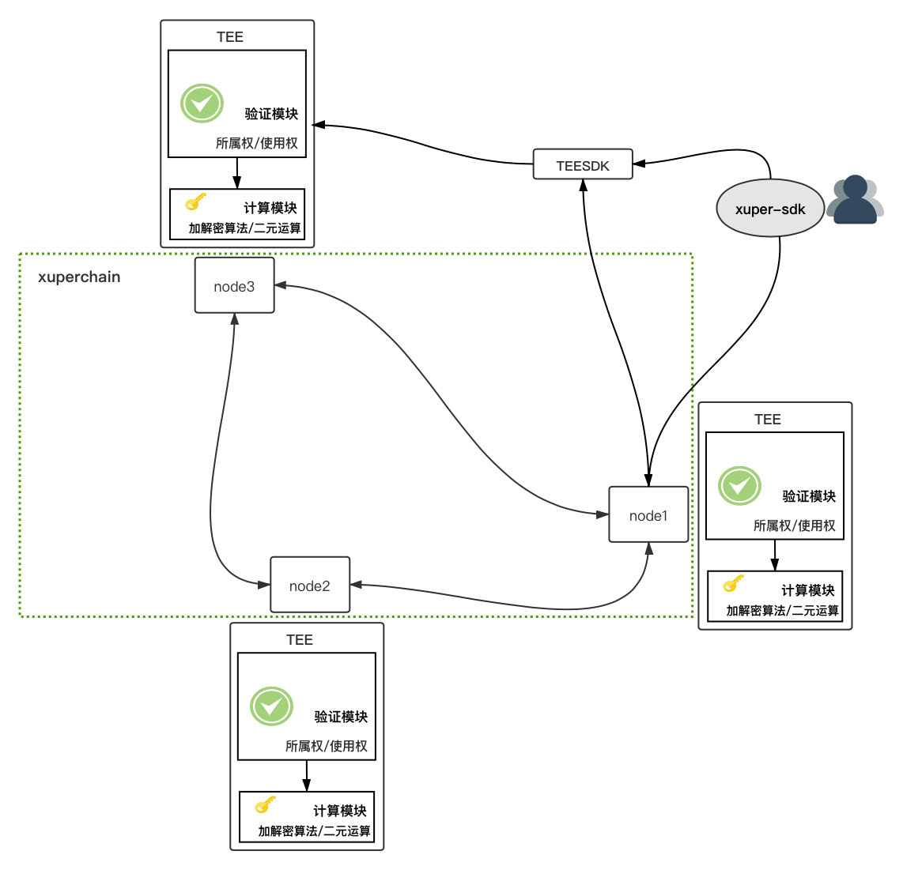

可信账本
==================

背景
----------

在大数据和人工智能时代，数据的广泛链接和应用导致隐私问题日益凸显。数据流通可以产生巨大的价值，而阻碍数据流通的主要因素就是数据隐私问题。保护数据安全既是对像百度这样的科技公司的要求，也是行业的底线。

为实现数据流通过程中的隐私保护， XuperChain 可信账本采用了Intel SGX和同态加密等多种技术，实现了数据隐私计算、数据权限管理和数据存证溯源功能。

名词解释
--------------

可信账本：基于百度 XuperChain 和Mesatee技术，支持合约数据加密存储及链上密文运算等功能。

TEE：可信执行环境(TEE)是CPU的安全区域，它可以保护在其内部加载的代码和数据的机密性与完整性。

SGX：Software Guard Extensions(SGX)是Intel推出的基于Intel CPU的硬件安全机制。

Mesatee：Memory Safe TEE(Mesatee)是百度基于Intel SGX设计的内存安全的可信安全计算服务框架。

架构设计
--------------

下图是可信账本的系统架构设计

	

TEESDK是与TEE服务请求的入口，将编译为动态链接库被 XuperChain 调用，实现链上的隐私计算。

可信账本目前支持数据加密存储、数据权限管理、秘钥托管和基本的密文计算功能，此部分代码暂未开源。

重要接口和数据结构
-------------------------

TEESDK
>>>>>>>>>>>

.. code-block:: go

    // 提交任务到TEE服务，返回计算结果
    func (s *TEEClient) Submit(method string, cipher string) (string, error) 

Xuperchain
>>>>>>>>>>>>>>>

.. code-block:: go

	// contractSDK
	// TEE隐私计算接口，供合约调用
	bool binary_ops(const std::string op, const Operand &left_op,
					const Operand &right_op, std::map<std::string, std::string> *result)
	bool authorize(const AuthInfo &auth, std::map<std::string, std::string> *result)

	// contract/teevm
	// 解析合约调用为可信账本调用
	func (tf *TrustFunctionResolver) ResolveFunc(module, name string) (interface{}, bool)   
	// 调用TEESDK插件执行链上隐私计算
	func (tf *TrustFunctionResolver) tfcall(ctx exec.Context, inptr, inlen, 
																					outpptr, outlenptr uint32) uint32

	// 可信账本配置，要设置TEESDK插件地址及相关配置地址
	type TEEConfig struct {
	   Enable     bool   `yaml:"enable"`     // enable: on or off to enable private ledger
	   PluginPath string `yaml:"pluginPath"` // path to dynamic library
	   ConfigPath string `yaml:"configPath"` // config path for the dynamic
	}

应用场景
--------------

秘钥托管
>>>>>>>>>>>>>

利用TEE托管私钥，保证私钥无法被外部访问。同时支持利用SGX的sealing技术进行私钥的持久化存储。

链上隐私计算
>>>>>>>>>>>>>>>>

可信账本可以实现链上密文存储和计算。例如， 姚氏百万富翁问题, 安全ID求交等。在政务数据共享领域，经常有数据安全交换的需求，希望实现所谓的”可以分享数据，但是不能篡改数据“，本质上就是如何保证数据所有权的前提下，挖掘数据的价值，放心地让其他方使用自身数据；

可信随机数
>>>>>>>>>>>>>>>

利用TEE可以生成可信随机数，联盟链节点之间可利用可信随机数进行共识。

