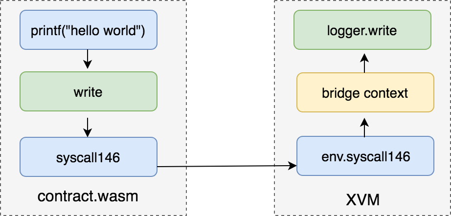

XVM虚拟机
=========

背景
----

XVM为合约提供一个稳定的沙盒运行环境，有如下目标:

- 隔离性，合约运行环境和xchain运行环境互不影响，合约的崩溃不影响xchain。
- 确定性，合约可以访问链上资源，但不能访问宿主机资源，保证在确定的输入下有确定的输出
- 可停止性，设置资源quota，合约对资源的使用超quota自动停止
- 可以统计合约的资源使用情况，如CPU，内存等
- 运行速度尽量快。

WASM简介
--------

WASM是WebAssembly的缩写，是一种运行在浏览器上的字节码，用于解决js在浏览器上的性能不足的问题。
WASM的指令跟机器码很相似，因此很多高级语言如C，C++，Go，rust等都可以编译成WASM字节码从而可以运行在浏览器上。
很多性能相关的模块可以通过用C/C++来编写，再编译成WASM来提高性能，如视频解码器，运行在网页的游戏引擎，React的虚拟Dom渲染算法等。

WASM本身只是一个指令集，并没有限定运行环境，因此只要实现相应的解释器，WASM也可以运行在非浏览器环境。
xchain的WASM合约正是这样的应用场景，通过用C++，go等高级语言来编写智能合约，再编译成WASM字节码，最后由XVM虚拟机来运行。
XVM虚拟机在这里就提供了一个WASM的运行环境。

WASM字节码编译加载流程
----------------------

WASM字节码的运行有两种方式，一种是解释执行，一种是编译成本地指令后再运行。
前者针对每条指令挨个解释执行，后者通过把WASM指令映射到本地指令如(x86)来执行，解释执行优点是启动快，缺点是运行慢，编译执行由于有一个预先编译的过程因此启动速度比较慢，但运行速度很快。

XVM选用的是编译执行模式。

.. figure:: ../images/xvm_compile.png
    :alt: XVM编译加载流程
    :align: center
    :width: 600px
    
    XVM编译加载流程

字节码编译
^^^^^^^^^^
用户通过c++编写智能合约，通过emcc编译器生成wasm字节码，xvm加载字节码，生成加入了指令资源统计的代码以及一些运行时库符号查找的机制，最后编译成本地指令来运行。

c++合约代码

.. code-block:: c++
    :linenos:

    int add(int a, int b) {
	    return a + b;
    }

编译后的WASM文本表示

.. code-block:: default
    :linenos:

    (module
    (func $add (param i32 i32) (result i32)
        local.get 0
        local.get 1
        i32.add)
    (export "_add" (func $add)))

XVM编译WASM到c，最后再生成动态链接库。

.. code-block:: c
    :linenos:

    static u32 _add(wasm_rt_handle_t* h, u32 p0, u32 p1) {
        FUNC_PROLOGUE;
        u32 i0, i1;
        ADD_AND_CHECK_GAS(3);
        i0 = p0;
        i1 = p1;
        i0 += i1;
        FUNC_EPILOGUE;
        return i0;
    }
    /* export: '_add' */
    u32 (*export__add)(wasm_rt_handle_t*, u32, u32);

    static void init_exports(wasm_rt_handle_t* h) {
        /* export: '_add' */
        export__add = (&_add);
    }

加载运行
^^^^^^^^

在了解如何加载运行之前先看下如何使用xvm来发起对合约的调用，首先生成Code对象，Code对象管理静态的指令代码以及合约所需要的符号解析器Resolver。
之后就可以通过实例化Context对象来发起一次合约调用，GasLimit等参数就是在这里传入的。Code和Context的关系类似Docker里面的镜像和容器的关系，
一个是静态的，一个是动态的。

.. code-block:: go
    :linenos:

    func run(modulePath string, method string, args []string) error {
        code, err := exec.NewCode(modulePath, emscripten.NewResolver())
        if err != nil {
                return err
        }
        defer code.Release()

        ctx, err := exec.NewContext(code, exec.DefaultContextConfig())
        if err != nil {
                return err
        }
        ret, err := ctx.Exec(method, []int64{int64(argc), int64(argv)})
       	fmt.Println(ret)
        return err
    }

转换后的c代码最终会编译成一个动态链接库来给XVM运行时来使用，在每个生成的动态链接库里面都有如下初始化函数。
这个初始化函数会自动对wasm里面的各个模块进行初始化，包括全局变量、内存、table、外部符号解析等。

.. code-block:: c
    :linenos:

    typedef struct {
        void* user_ctx;
        wasm_rt_gas_t gas;
        u32 g0;
        uint32_t call_stack_depth;
    }wasm_rt_handle_t;

    void* new_handle(void* user_ctx) {
        wasm_rt_handle_t* h = (*g_rt_ops.wasm_rt_malloc)(user_ctx, sizeof(wasm_rt_handle_t));
        (h->user_ctx) = user_ctx;
        init_globals(h);
        init_memory(h);
        init_table(h);
        return h;
    }

语言运行环境
------------

c++运行环境
^^^^^^^^^^^

c++因为没有runtime，因此运行环境相对比较简单，只需要设置基础的堆栈分布以及一些系统函数还有emscripten的运行时函数即可。

c++合约的内存分布

    
    c++合约的内存分布

普通调用如何在xvm解释

    
    xvm符号解析

go运行环境
^^^^^^^^^^

.. figure:: ../images/gowasm.png
    :alt: go合约运行时结构
    :align: center
    :width: 400px
    
    go合约运行时结构

XuperBridge对接
---------------

XVM跟XuperBridge对接主要靠两个函数

- call_method，这个函数向Bridge传递需要调用的方法和参数
- fetch_response，这个函数向Bridge获取上次调用的结果

.. code-block:: c++
    :linenos:

    extern "C" uint32_t call_method(const char* method, uint32_t method_len,
                                const char* request, uint32_t request_len);
    extern "C" uint32_t fetch_response(char* response, uint32_t response_len);

    static bool syscall_raw(const std::string& method, const std::string& request,
                            std::string* response) {
        uint32_t response_len;
        response_len = call_method(method.data(), uint32_t(method.size()),
                                request.data(), uint32_t(request.size()));
        if (response_len <= 0) {
            return true;
        }
        response->resize(response_len + 1, 0);
        uint32_t success;
        success = fetch_response(&(*response)[0u], response_len);
        return success == 1;
    }

资源消耗统计
------------

考虑到大部分指令都是顺序执行的，因此不需要在每个指令后面加上gas统计指令，
只需要在control block最开头加上gas统计指令，所谓control block指的是loop, if等会引起跳转的指令。

c++代码

.. code-block:: c
    :linenos:

    extern int get(void);
    extern void print(int);

    int main() {
            int i = get();
            int n = get();
            if (i < n) {
                    i += 1;
                    print(i);
            }
            print(n);
    }

编译后生成的wast代码

.. code-block:: default
    :linenos:

    (func (;2;) (type 1) (result i32)
        (local i32 i32)
        call 1
        local.tee 0
        call 1
        local.tee 1
        i32.lt_s
        if  ;; label = @1
            local.get 0
            i32.const 1
            i32.add
            call 0
        end
        local.get 1
        call 0
        i32.const 0)

生成的带统计指令的c代码

.. code-block:: c
    :linenos:
    
    static u32 wasm__main(wasm_rt_handle_t* h) {
        u32 l0 = 0, l1 = 0;
        FUNC_PROLOGUE;
        u32 i0, i1;
        ADD_AND_CHECK_GAS(11);
        i0 = wasm_env__get(h);
        l0 = i0;
        i1 = wasm_env__get(h);
        l1 = i1;
        i0 = (u32)((s32)i0 < (s32)i1);
        if (i0) {
            ADD_AND_CHECK_GAS(6);
            i0 = l0;
            i1 = 1u;
            i0 += i1;
            wasm_env__print(h, i0);
        }
        ADD_AND_CHECK_GAS(5);
        i0 = l1;
        wasm_env__print(h, i0);
        i0 = 0u;
        FUNC_EPILOGUE;
        return i0;
    }

