XuperBridge
===========

内核调用设计
------------

XuperBridge为所有合约提供统一的合约接口，从抽象方式上类似于linux内核对应于应用程序，内核代码是一份，应用程序可以用各种语言实现，比如go,c。类比到合约上就是各种合约的功能，如KV访问，QueryBlock, QueryTx等，这些请求都会通过跟xchain通信的方式来执行，这样在其上实现的各种合约虚拟机只需要做纯粹的无状态合约代码执行。

    
    XuperBridge

合约与xchain进程的双向通信
^^^^^^^^^^^^^^^^^^^^^^^^^^

xchain进程需要调用合约虚拟机来执行具体的合约代码，合约虚拟机也需要跟xchain进程通信来进行具体的系统调用，如KV获取等，这是一个双向通信的过程。

    
    合约双向通信

这种双向通信在不同虚拟机里面有不同的实现，

- 在native合约里面由于合约是跑在docker容器里面的独立进程，因此牵扯到跨进程通信，这里选用了unix socket作为跨进程通信的传输层，xchain在启动合约进程的时候把syscall的socket地址以及合约进程的socket地址传递给合约进程，合约进程一方面监听在unix socket上等待xchain调用自己运行合约代码，另一方面通过xchain的unix socket创建一个指向xchain syscall服务的grpc客户端来进行系统调用。

    
    合约socket

- 在WASM虚拟机里面情况有所不同，WASM虚拟机是以library的方式链接到xchain二进制里面，所以虚拟机和xchain在一个进程空间，通信是在xchain和WASM虚拟机之间进行的，这里牵扯到xchain的数据跟虚拟机里面数据的交换，在实现上是通过WASM自己的模块机制实现的，xchain实现了一个虚拟的WASM模块，合约代码执行到外部模块调用的时候就转到对应的xchain函数调用，由于xchain和合约代码的地址空间不一样，还是牵扯到序列化和反序列化的动作。

    
    WASM合约

PB接口
^^^^^^

合约暴露的代码接口

.. code-block:: console
    :linenos:

    service NativeCode {
        rpc Call(CallRequest) returns (CallResponse);
    }

xchain暴露的syscall接口

.. code-block:: console
    :linenos:

    service Syscall {
        // KV service
        rpc PutObject(PutRequest) returns (PutResponse);
        rpc GetObject(GetRequest) returns (GetResponse);
        rpc DeleteObject(DeleteRequest) returns (DeleteResponse);
        rpc NewIterator(IteratorRequest) returns (IteratorResponse);

        // Chain service
        rpc QueryTx(QueryTxRequest) returns (QueryTxResponse);
        rpc QueryBlock(QueryBlockRequest) returns (QueryBlockResponse);
        rpc Transfer(TransferRequest) returns (TransferResponse);
    }

KV接口与读写集
--------------

KV的接口：

- GetObject(key)
- PutObject(key, value)
- DeleteObject(key)
- NewIterator(start, limit)

各个接口对读写集的影响：

- Get会生成一个读请求
- Put会产生一个读加一个写
- Delete会产生一个读加一个特殊的写（TODO）
- Iterator会对迭代的key产生读

效果：

- 读请求不会读到最新的其他tx带来的变更
- 读请求会读到最新的自己的写请求（包括删除）的变更
- 写请求在提交前不会被其他合约读到
- 新写入的会被迭代器读到

实现：

cache部分采用ordered map实现, value部分结构如下

.. code-block:: console
    :linenos:

    type Value struct {
        Value []byte
        Flag  uint32
        Ref   *Txinput
    }

在生成读写集的时候根据Flag判断是只读引用还是写入或者是删除，最后遍历一遍整个map按照key的顺序生成读写集。

合约上下文
----------

每次合约运行都会有一个伴随合约执行的上下文(context)对象，context里面保存了合约的kv cache对象，运行参数，输出结果等，context用于隔离多个合约的执行，也便于合约的并发执行。

Context的创建和销毁
^^^^^^^^^^^^^^^^^^^

context在合约虚拟机的Run函数里面创建，在xuper3里面已经是每次执行合约的时候创建context。每个context都有一个context id，这个id由合约虚拟机维护，在xchain启动的时候置0，每次创建一个context对象加1，合约虚拟机保存了context id到context对象的映射。context id会传递给合约虚拟机，在Docker里面即是合约进程，在之后的合约发起KV调用过程中需要带上这个context id来标识本次合约调用以找到对应的context对象。

context的销毁时机比较重要，因为我们还需要从context对象里面获取合约执行过程中的Response以及读写集，因此有两种解决方案，一种是由调用合约的地方管理，这个是xuper3里面做的，一种是统一销毁，这个是目前的做法，在打包成块结束调用Finalize的时候统一销毁所有在这个块里面的合约context对象。

合约上下文的操作
^^^^^^^^^^^^^^^^

- MakeContext，创建一个context，需要合约的参数等信息
- RunContext，运行一个context，这一步是执行合约的过程，合约执行的结果会存储在context里面
- CommitContext，提交context，这一步会把上下文里面对状态的修改提交到持久化层里面，对应MPT就是提交根，对应XuperModule就是生成读写集

跨合约调用
----------

受限于目前的合约调用方式，跨合约调用目前只在native合约里面实现，等后面xuper3统一存储模型就可以真正做到真正的跨虚拟机实现的跨合约调用。

在跨合约调用模型中2个状态需要记录：

KV状态的修改
^^^^^^^^^^^^

KV在目前的合约实现里面是通过MPT来实现的，合约执行完毕后生成root hash，验证节点通过验证root hash是否一致来验证KV状态是否一致，在跨合约调用中由于牵扯了多个合约的MPT状态修改，同时每个合约都是一棵单独的树，因此没办法统一root hash，因此在这里我们采用默克尔树的思想，把多个合约修改后的root hash通过字符串拼接的方式组成一个新的串，在hash之后生成多个MPT root的联合hash，验证节点采用相同的算法生成hash串，比对是否相同即可。

还有一个问题需要确定：多个root hash通过什么顺序来组合？

有两个方案：

- root hash按字母序排列之后再组合
- 按合约的调用顺序以后序遍历的顺序连接root hash

转账带来的对UTXO的修改
^^^^^^^^^^^^^^^^^^^^^^

跟之前的合约内transfer一样，通过生成新tx的方式来支持被调用合约内部调用转账，所有新生成的tx的ContractRef指向root tx id，新生成的排列方式按照调用转账的顺序生成。

    
    合约内转账排列

调用递归层数的限制
^^^^^^^^^^^^^^^^^^

合约调用在入口的地方可以传递一个计数器，每次进行合约调用就加一，如果计数器超过指定阈值则直接执行失败。

合约调用方式的更改
^^^^^^^^^^^^^^^^^^

在目前版本(<=2.3)里面，native合约的调用方式为在执行合约之前统一执行SetContext，打包块结束后再执行Finalize，从这种调用方式上可以看出我们假定合约上下文的生命周期是在一个块里面，我们需要改成状态内敛到合约上下文。

共享tx结构体
^^^^^^^^^^^^

整个跨合约调用的过程中tx结构体是共享的，所有合约执行的时候被认为是在同一个交易里面进行的，但参数会专门设置。

状态的回滚
^^^^^^^^^^

native合约在执行失败的时候，不会提交MPT，在多合约执行的情况下